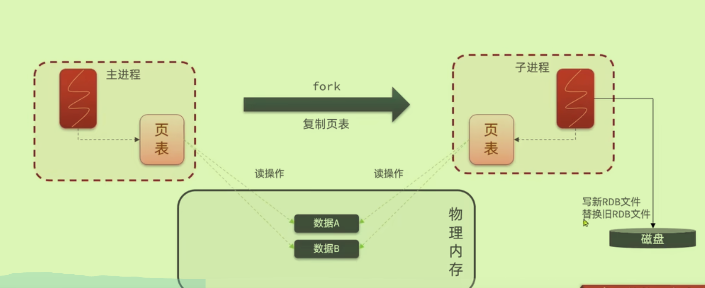

# 数据持久化（数据丢失）

首先明确，Redis基于内存。

## RDB持久化

- 在配置文件中有关于RDB的触发机制，但是还是存在数据丢失风险
- 子进程**异步**几乎对主进程0阻塞

### 原理

- 只复制主进程的页表（虚拟物理内存映射表），得到对应的物理内存信息（像请了个代理对象一样）

为了防止异步产生的脏数据，采用**copy-on-write**技术(写副本)

## AOF

记录Redis中的每个**写命令**（appendonly）；默认关闭，采用`everysec`

提供`bgrewriteaof`命令，对AOF文件进行重写（可以省去一些无用多余的命令）

## 对比

实际情况结合使用。

# 主从集群（并发读）

- 可以实现读写分离，但要做到数据同步
- 在**子节点**上执行相关指令`slaveof <masterIp> <masterPort>` 或者`replicaof <masterIp> <masterPort>`

### 全量同步原理

第一次同步**全量同步**（RDB拷贝页表）

master如何判断是否为第一次同步：

- 第一次同步判断依靠id，如果不一样，肯定是第一次
- 后续的更新数据进度靠offset

### 增量同步原理

- `repl_backlog`是一个环形数组结构，如果从节点恢复前未同步的数据太多则会造成数据丢失

### 优化同步

# Redis哨兵（故障恢复）

为主从集群提供了自动故障恢复能力：三种功能

## 如何实现监控

## 如何恢复故障

重点在offset处

### 故障转移

## 通知

Redis客户端通常不会直接从哨兵那里接收实时通知。而是客户端需要自行处理如何在故障转移后重新连接到新的主节点：

- **主动查询**：客户端在无法连接到主节点时，可以主动向哨兵查询当前的主节点地址。这通常发生在客户端尝试与主节点通信时发现连接失败后。
- **订阅模式**：客户端也可以订阅哨兵的`__sentinel__:hello`频道。哨兵会定期在这个频道发布所有监控的主节点和其对应从节点的状态信息。通过这种方式，客户端可以实时获取最新的主从配置信息。
- **配置更新**：在哨兵配置发生变化时（例如，主节点发生变更），哨兵会向所有已注册的客户端发送新的配置信息。客户端库需要实现适当的逻辑来处理这些更新。

## RedisTemplate实现哨兵

无需知道Redis集群地址，知道Sentinel的地址即可（因为Redis集群地址会变化）；由哨兵知道集群状态

还要设置读写策略（读写分离），在启动类中：

# 分片集群（存储能力）

与主从不同的是，分片在做水平扩展容量，而主从在做数据的拷贝复制；当数据量大时采用分片，当要求高性能时采用主从。

分片中可以包含主从——多个Master下可以自带slave

## 散列插槽

为每一个master节点分配**插槽，与数据的key绑定**。（由key计算Hash，再由Hash计算插槽值）

*同一类型的数据使用相同的{}，可以保证其在同一个Redis实例中。*——控制Key的有效部分。

## 集群伸缩

本质是在转移插槽到不同节点上。

## 故障转移

无需哨兵，自动完成主从切换。

可以手动实现Master和slave之间的数据迁移。`cluster failover`命令

## RedisTemplate实现

没有哨兵，所以需要配备每个节点的地址。

