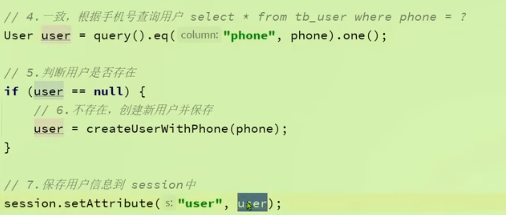
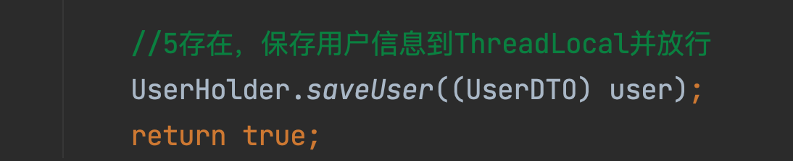
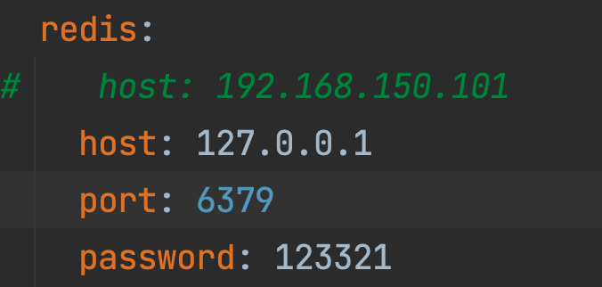
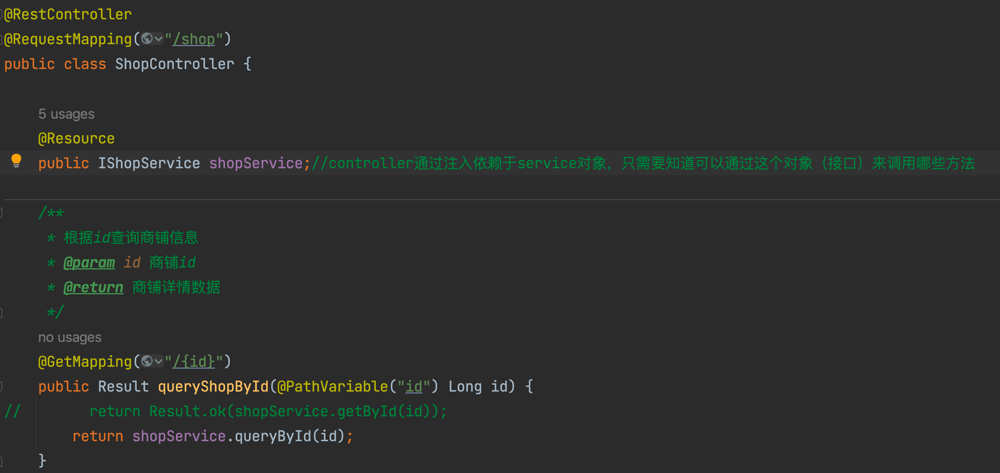

# 黑马点评遇到的问题

## Macbook无法打开Nginx.exe文件

### 方法一：配置文件

将所给资料里面的Nginx的配置文件以及html文件拷贝进本机（使用homebrew下载的）Nginx文件夹中。

资料中的配置

使用以下命令拷贝

拷贝HTML文件`cp -r /Users/lutao/GitT/JavaCode/HeiMaDianPing/nginx-1.18.0/html/* /opt/homebrew/var/www/`

备份原始配置文件`cp /opt/homebrew/etc/nginx/nginx.conf /opt/homebrew/etc/nginx/nginx.conf.backup`

拷贝配置文件`cp /Users/lutao/GitT/JavaCode/HeiMaDianPing/nginx-1.18.0/conf/nginx.conf /opt/homebrew/etc/nginx/nginx.conf`

最后检查并重启Nginx在页面上成功出现所要内容

- `nginx -t`
- `brew services restart nginx`

黑马点评前端页面

### 思考的问题

#### 为什么可以成功

相当于改变了原始Nginx中的配置和资源文件，在Nginx服务器启动时，它会读取改变后的配置文件来设置服务器。

#### 以后每做一个项目都要这样吗

如果只更新静态内容（HTML，CSS）只需要替换或者更改相关的文件，不需要改变nginx配置；但是不同项目可能有不同的路径和端口，需要在nginx的配置文件中（如负载均衡upstream）进行修改。

自动化处理频繁的变更：你可以考虑使用模板引擎或配置管理工具（如Ansible、Chef、Puppet）来管理和部署Nginx配置，这样可以大大简化管理过程，并减少因手动错误而导致的问题。对于复杂的环境，使用持续集成/持续部署（CI/CD）管道来自动化测试和部署过程也是常见做法。（来自于ChatGpt）

## 为什么需要登录校验拦截器

拦截器有助于预防未经授权的访问，确保只有经过认证的用户才能访问资源。

## Cookie和Session什么关系

1、Session

- Session是在服务器端保存用户状态的方式，对于每个用户，服务器都会创建一个独一无二的Session。
- 服务器可以跟踪用户的状态和数据，如登录凭证、购物车内容等。
- 内存层面，Key、value结构

2、Cookie

- Cookie数据存储在客户端（用户的浏览器）上。
- 主要用于跟踪用户的浏览器会话，以及保存用户的偏好和登录状态等。

3、配合使用

- 服务器会在用户的*浏览器上设置一个Cookie，其中包含一个唯一的Session标识符（Session ID）*。浏览器每次向服务器发送请求时都会携带这个Cookie，服务器通过解析Cookie中的Session ID来识别用户和其会话状态

## 在做登录校验时为什么会出现类型错误

在Login登录功能的实现中，我们将全部的用户信息保存在了User类的User对象中，并放入到了**session**：

- 

在进行拦截器编写时，又将**session中**的User放到了线程中并进行了类型强转

- 

所以会出现类型转换错误：

`class com.hmdp.entity.User cannot be cast to class com.hmdp.dto.UserDTO (com.hmdp.entity.User and com.hmdp.dto.UserDTO are in unnamed module of loader 'app')`

如何解决：

将Login登录中的用户信息保存到session中时不需要保存为User类型（这是信息的粒度问题），将其转换为UserDTO类型即可。

## 为什么登录成功页面点击我的不跳转

前端代码问题，重要的是用户数据已经在数据库里即可。

## 使用Redis时发送验证码失败

错误显示：`Unable to connect to Redis; nested exception is org.springframework.data.redis.connection.PoolException: Could not get a resource from the pool; nested exception is io.lettuce.core.RedisConnectionException: Unable to connect to 192.168.150.101/<unresolved>:6379 at `

很明显连接Redis失败，原因是配置文件中没有修改Redis的配置，黑马讲解使用了虚拟机的IP地址，而我使用了本机启动的Redis，所以配置应该改为127.0.0.1

## Controller和Service如何交互

