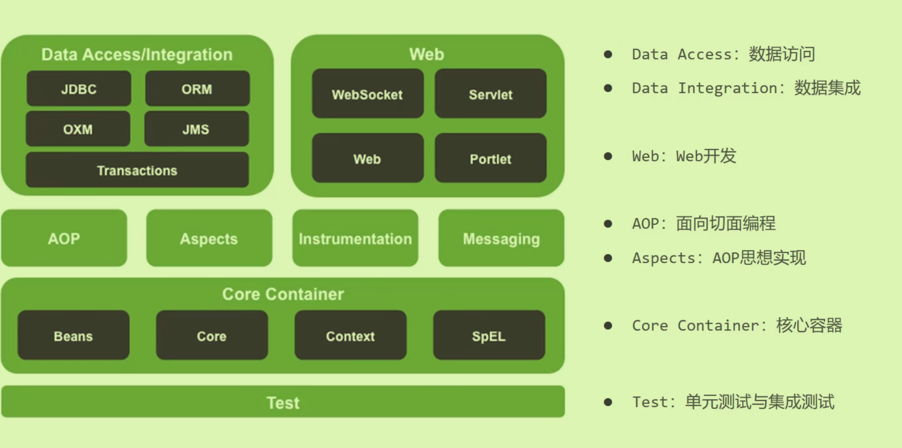

# 核心容器

## SpringFrameWork的系统架构：

- **核心容器管理对象**

## 核心概念

### IoC控制反转

- 为了*降低代码的耦合度*，创建对象不要主动使用`new`创建，转为外部提供对象
- **对象的创建控制权转到外部**；Spring提供了一个*IoC容器，充当外部*
- IoC将其管理创建的对象称为**Bean**

### DI（Dependency Injection)依赖注入

- 容器中创建**bean之间的依赖关系**

## IOC案例：

