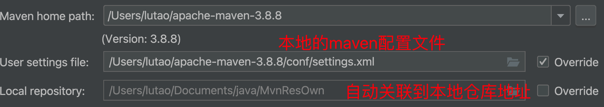
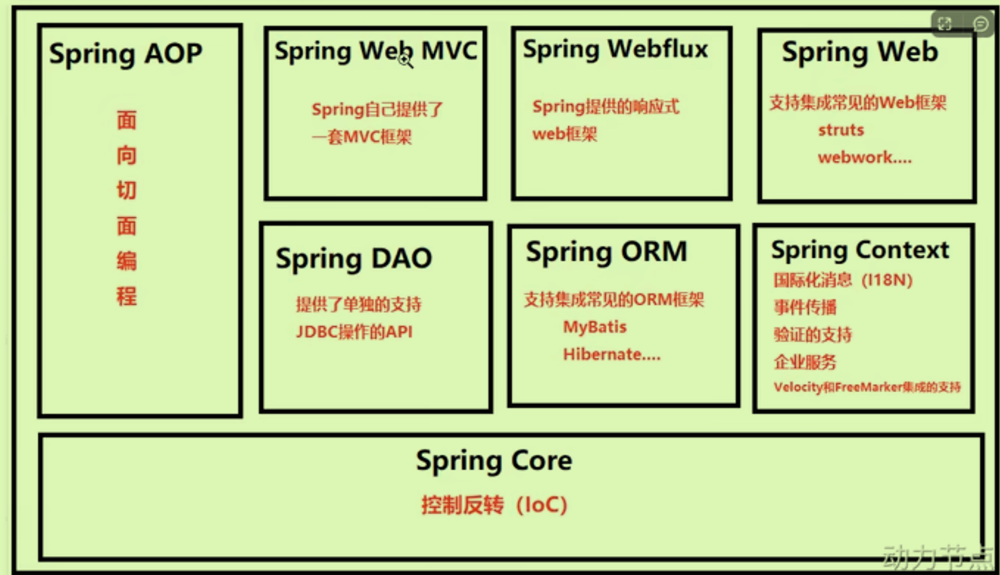
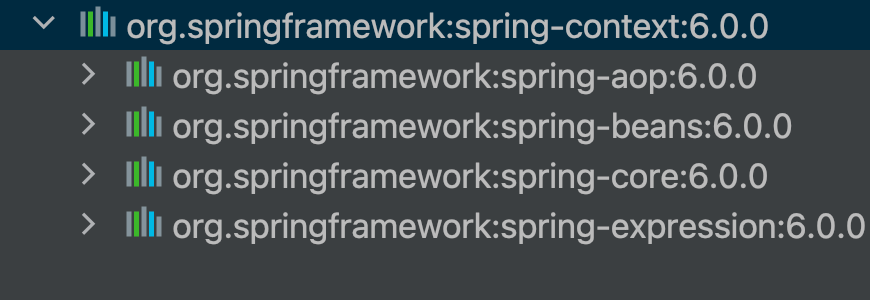
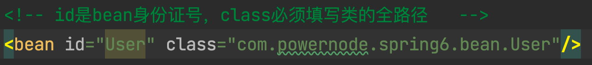
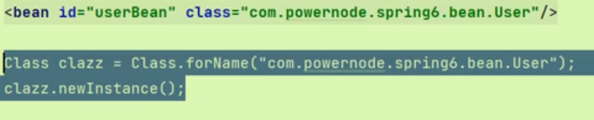
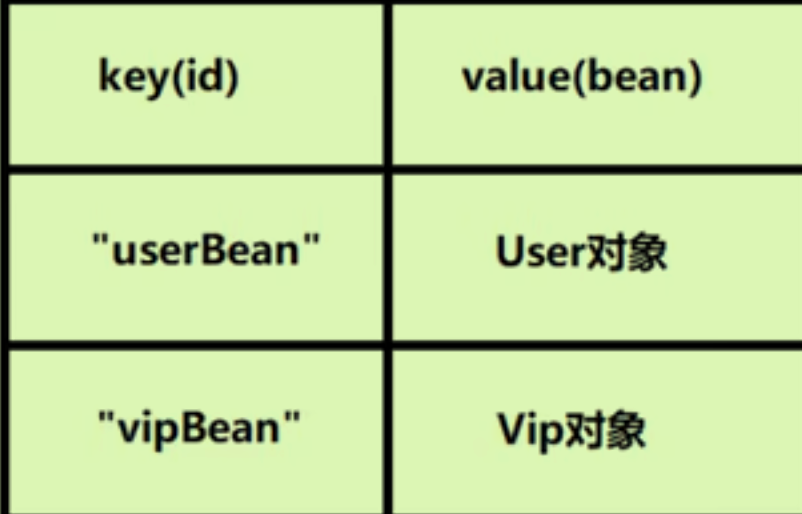

# Spring启示录

首先进行环境设置：

- 设置工程的JDK，Project Structure
- 其次设置Maven管理

- 新建模块。

## OCP原则

开闭原则Open Close Principle，七大原则最基本的原则，其他都是为这个原则服务的。

- 对扩展开放
- 对修改关闭

扩展系统功能时没有修改以前的代码。

## DIP原则

依赖倒置原则，上层不再依赖于下层。（Service依赖于Dao的实现类）

- 倡导面向接口，抽象编程，而不是面向具体实现类编程。
- 将创建对象的过程以及层之间关系的维护交给其他来做——控制反转的编程思想。

## IOC思想

Inversion of Control控制反转

- 不在代码中使用硬编码方式new对象
- 不在代码中采用硬编码方式维护对象的关系。

## 引出Spring框架

Spring是一个实现了IOC思想的**容器**；依赖注入DI是这种思想的具体实现：**依赖（关系）注入（手段产生关系）**——依赖注入是管理对象之间的关系的。

- Set注入：通过Set方法给其属性赋值
- 构造方法注入：通过构造方法为属性赋值
- 对象A和B之间的关系通过注入手段维护

### Spring8大模块

最核心的还是IOC思想。



侵入式设计：某个框架运行需要依赖其他东西（例如Tomcat）；而Spring非侵入式，全靠自己。

每一个被Spring管理的对象叫做Bean，所以Spring被称为容器。

## Spring入门程序

#### 引入依赖

首先引入Spring Context依赖，是Spring的基础依赖。

### 使用Spring创建对象

首先，在**resource根目录**下（相当于类的根路径下）创建Spring的配置文件（IDEA提供了模版）；并配置bean，这样才可以由Spring管理对象。



```java
        //1获取spring容器对象
        //ApplicationContext是一个接口，class是其其中一个实现类
        //ClassPathXmlApplicationContext从类路径中加载spring配置文件的一个上下文对象
        ApplicationContext applicationContext = new ClassPathXmlApplicationContext("spring.xml");
        //启动了spring容器，解析spring.xml文件，并且实例化所有bean对象，放到容器当中。

        //2根据bean的id从spring容器中获取实例对象
        Object userBean = applicationContext.getBean("UserBean");
				Date nowTime = applicationContext.getBean("DateBean",Date.class)
        System.out.println(userBean);
```

- 还可以指定返回对象的类型，不只是Object:第二个参数加类名.class

#### 底层原理

- 默认通过**反射机制调用类的无参构造方法**来实例化对象
- 如果只有有参构造，无参构造不会存在，也无法创建对象。
- 创建好的对象存储到了一个Map<String,Object>集合里
- ApplicationContext接口的超级父接口是BeanFactory,生产Bean对象的一个工厂对象，是IOC的顶级接口，故Spring使用了工厂模式+XML解析+反射机制。
- **不是在调用getBean才创建对象**，而是在上一行代码就会创建对象。

#### 细节注意

配置文件

- Spring可以有多个配置文件，获取Spring容器的代码可以写多个配置文件`ApplicationContext applicationContext = new ClassPathXmlApplicationContext("spring.xml","bean.xml");`
- 也可以使用路径`xml/beans.xml`

也可以自动生成Java自己的类如Date对象；如果bean的id不存在，返回异常。

### 使用log4j2记录日志信息 

```java
Logger logger = LoggerFactory.getLogger(FirstSpringTest.class);//获取对应类的日志记录器对象
logger.info("");
logger.debug("");
logger.erro("");
```

## SpringIOC原理

### Spring容器

读取Bean配置信息——生成Bean配置注册表——根据表实例化Bean——装配好依赖关系，将Bean放入Spring容器中管理
