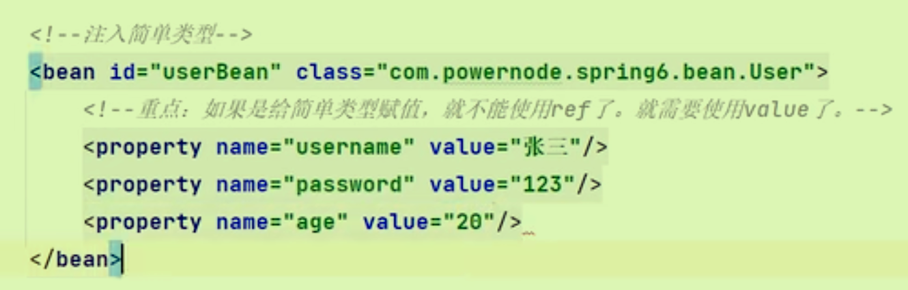
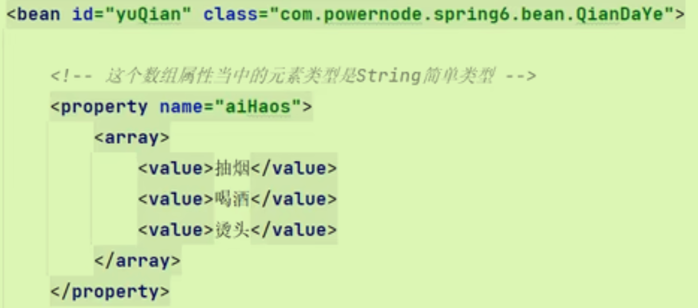
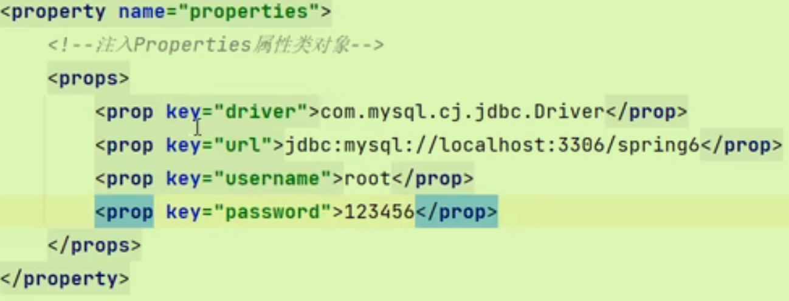
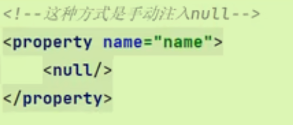
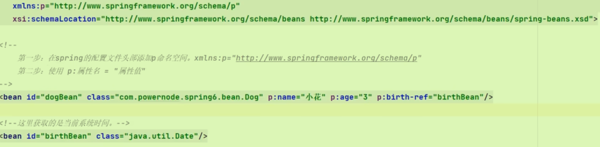
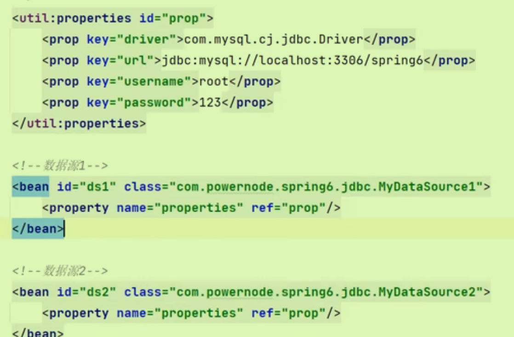
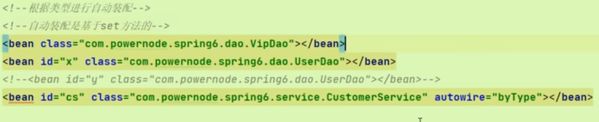
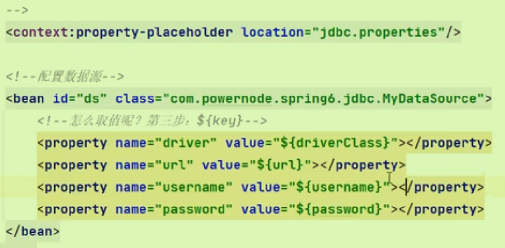

# 依赖注入

## 入门两个注入

### Set注入

通过反射机制调用set方法来给属性赋值，使两个对象产生关系。

```java
public class UserService {
    private UserDao userDao;
    //使用set注入，给userDao属性赋值。使用IDEA工具生成，符合javaBean规范
    public void setUserDao(UserDao userDao) {
        this.userDao = userDao;
    }

    public void saveUser(){
        userDao.insert();
    }
}
```

```xml
    <bean id="UserServiceBean" class="com.powernode.spring6.service.UserService">
        <!-- name指向set方法，ref指定的是要注入的bean的id       -->
        <property name="userDao" ref="UserDaoBean"/>
    </bean>
```

- 注意，name的值必须是set方法去掉set后将方法名小写的结果（当然如果使用自动生成可以直接复制类名）
- 相当于在bean标签中加入property和ref来指定相关的set方法来联系两个对象
- set注入是**先创建对象再执行set方法**。

### 构造注入

```java
public class CustomerService {
    private UserDao userDao;
//使用构造方法注入
    public CustomerService(UserDao userDao) {
        this.userDao = userDao;
    }

    public void save(){
        userDao.insert();
    }
}
```

```xml
    <bean id="CustomerServiceBean" class="com.powernode.spring6.service.CustomerService">
        <!-- index指定构造方法参数下标，ref指定注入的bean的id       -->
        <constructor-arg index="0" ref="UserDaoBean"/>
<!--        <constructor-arg index="1" ref="UserDaoBean"/>-->
    </bean>
```

- 构造注入也可以使用name根据参数名（index）；或者可以不指定任何东西，直接使用ref，spring会自己做类型匹配

## Set注入专题

### 注入外部bean

与上面Set注入入门程序相同，是平时常用的。

### 注入内部bean

在property内部再来一个bean标签，直接指定类名即可，不用id

```xml
    <bean id="orderServiceBean2" class="com.powernode.spring6.service.OrderService">
        <property name="orderDao">
            <bean class="com.powernode.spring6.dao.OrderDao"/>
        </property>
    </bean>
```

### 注入简单类型

之前使用的都是对象，是引用数据类型；也可以注入普通数据类型，注意**要使用value**



哪些类型是简单类型呢？在BeanUtils工具类下进行搜索（search everywhere，自行设置快捷键）方法（isSimple)

- 注意，16种类型及其包装类是简单类型；*字符串，枚举，时区*等也是
- Date日期类型也是简单类型，但是其value格式有要求;所以开发中还是当做引用类型，采用ref赋值。

应用：Mybatis连接数据库时需要提供driver,url,username,password等配置信息，所以我们可以将其认为是注入简单类型（写在配置文件中）

### 注入数组

- 数组中的类型为普通数据类型时，使用value填充数组：

- 数组中的类型为引用类型时，将array标签中改为`ref bean=id`

### 注入List集合和Set集合

注意，List集合有序和重复；Set集合无需有序且不重复；使用list标签和Set标签替换Array标签

### 注入Map集合

使用map标签以及entry,value标签，注意非简单类型使用`<entry key-ref="" value-ref=""/>`

注意**Properties也是Map集合的一种**，但是其要求与Map不同：



### 注入null和空字符串

- 不给属性注入，属性的默认值就是null；如果value设置为null则是*注入null字符串*。
- 手动注入：

- 由于null可能会存在**空指针异常**，所以可以注入空字符串，将value设置为""

### 如何处理value中的特殊符号

- 使用实体符号代替特殊符号（难记）
- 使用`<![CDATA[语句]]>`，只能用**value标签**（不是普通的value）

### P命名空间注入

本质也是set注入。

- 配置文件头部增加相关p配置
- 不再使用property，而是直接`p:属性名="属性值"`；如果不是简单类型在属性名之后加`-ref`即可



## C命名空间注入

简化构造注入。

方法与上面的P命名空间相似。

## Util命名空间注入

对配置信息的复用。（连接相同的数据库使用不同的数据源）

- 配置头部配置信息(还要在schema里面添加util，为了可以使用util标签)

```xml
<beans xmlns="http://www.springframework.org/schema/beans"
       xmlns:xsi="http://www.w3.org/2001/XMLSchema-instance"
       xmlns:util="http://www.springframework.org/schema/util"
       xsi:schemaLocation="http://www.springframework.org/schema/beans http://www.springframework.org/schema/beans/spring-beans.xsd
                           http://www.springframework.org/schema/util http://www.springframework.org/schema/util/spring-util.xsd">

</beans>
```

- 使用util标签

## 自动装配AutoWiring

基于**set**方式。

是实现依赖注入的一种方便的工具。

### 名称

```xml
    <bean id="orderDao" class="com.powernode.spring6.dao.OrderDao" ></bean>

    <bean id="orderService" class="com.powernode.spring6.service.OrderService" autowire="byName"/>
```

- 注意被注入的对象的bean的id一定得满足规范

### 类型



- 需要注意某种类型的实例只能有一个
- 可以不需要id，因为基于类型。

### 使用

类比上面的构造方法注入，我们需要在xml文件中写比较复杂的`constructor-args`，但是如果使用自动装配，就只需要注解`AutoWired`即可，Spring会自动查找所有类型为所设定的Bean，将其注入。

```java
@Component
public class SpellChecker {
    public SpellChecker() {
        System.out.println("SpellChecker initialized.");
    }

    public void checkSpelling(String text) {
        // 检查拼写的逻辑
    }
}

@Component
public class EmailService {
    private SpellChecker spellChecker;

    @Autowired
    public void setSpellChecker(SpellChecker spellChecker) {
        this.spellChecker = spellChecker;
    }

    public void sendEmail(String message) {
        spellChecker.checkSpelling(message);  // 在发送前检查拼写
        // 发送电子邮件的逻辑
    }
}

```


```xml
    <!-- 定义SpellChecker bean -->
    <bean id="spellChecker" class="com.example.SpellChecker">
    </bean>

    <!-- 定义EmailService bean 并自动按类型装配依赖 -->
    <bean id="emailService" class="com.example.EmailService" autowire="byType">
    </bean>
```


## Context引入外部配置文件

- 引入context命名空间，类比Util的引入
- 再使用标签来确定配置文件路径
- 最后使用`${key}`来获取配置值，但是注意此**符号优先取系统变量**。（所以尽量在key前面加点标签）

