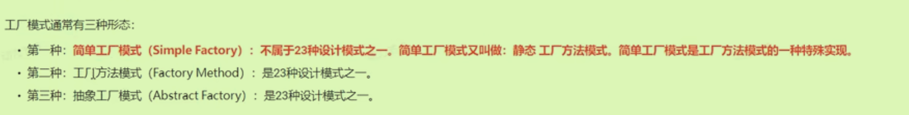
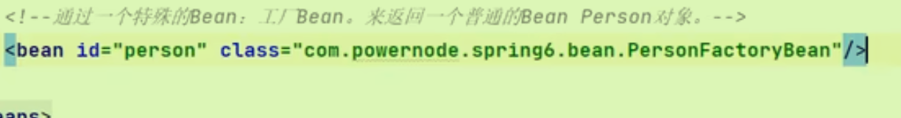

# Bean作用域

## 原始scope

Spring*默认情况*下Spring创建的Bean是**单例（Singleton)**的，并且在Spring上下文初始化时进行创建（所以getBean方法得到的都是同一个Bean）

可以设置scope为prototype，创建的Bean对象不是单例，每一个都是独特的。

## 其他scope

想要其他的scope，应用于不同的场景中（如web应用）；需要引入相关的依赖。

### Request

在一次 Http 请求中，容器会返回该 Bean 的同一实例。而对不同的 Http 请求则会产生新的 Bean，而且该 bean 仅在当前 Http Request 内有效,当前 Http 请求结束，该 bean 实例也将会被销毁。

- 当你需要保持bean状态仅在单个请求内部时。
- 当bean的数据和状态与特定的HTTP请求强相关时。

### Session

同上，改为一次Http Session中。

- 当你需要在用户的整个会话中保持某些信息和状态时，如用户的偏好设置、登录状态等。
- 当bean的数据需要跨多个请求共享和保持时。

二者都是为Web用用设计。

### 自定义scope

见老杜笔记

# GoF工厂模式(Gang of Four)

工厂模式属于创建型模式（创建对象的）



- 工厂模式使用了具体工厂类（而不是简单工厂中只用了一个抽象工厂类），从而添加业务时只需要添加具体工厂类，**没有更改之前的代码**。（符合OCP）

# Bean的获取方式

## 1构造方法实例化

平时最基础的模式。

## 2简单工厂模式实例化

需要在配置文件中，告诉Spring调用**哪个类的哪个方法**获取Bean

且简单工厂对应静态方法（就不需要创建对象）。

```xml
<bean id="starBean" class="com.powernode.spring6.bean.startFactory" factory-method="get"/>
```

```java
public class startFactory {
    public static Star get(){
        //通过这个静态方法创建StarBean
        return new Star();
    }
}
```

- 底层实际上还是构造方法实例化

## 3工厂方法模式实例化

告诉Spring调用**哪个对象的哪个方法**获取Bean（与上面简单工厂对应）

一个工厂对应一个产品。（需要创建对象）

需要**`factory-bean factory-method`**两个属性，一个表示调用哪个对象，一个表示哪个方法

```xml
<bean id="gunFactory" class="com.powernode.spring6.bean.GunFactory"/>
<bean id="gun" factory-bean="gunFactory" factory-method="get"/>
```

## 4通过FactoryBean接口实例化

实现其接口的方法，不用再自定义方法三中的两个属性。

一旦实现接口，*Spring将其视作工厂Bean就不用自定义那两个属性了*。

```java
public class PersonFactoryBean implements FactoryBean<Person> {

    @Override
    public Person getObject() throws Exception {
        return null;
    }

    @Override
    public Class<?> getObjectType() {
        return null;
    }
    //此方法有默认实现
    @Override
    public boolean isSingleton() {
        return FactoryBean.super.isSingleton();
    }
}
```



### BeanFactory和FactoryBean的区别

前者是顶级接口，而后者是一个特殊的Bean（辅助其他Bean创建它们的Bean对象）