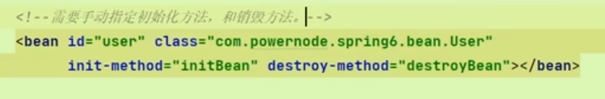
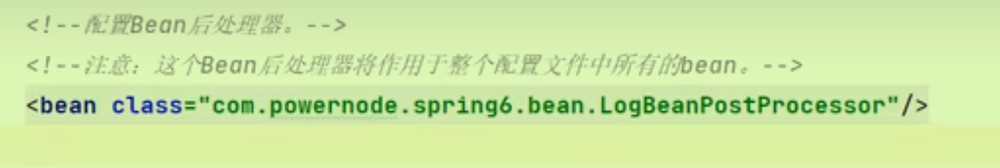
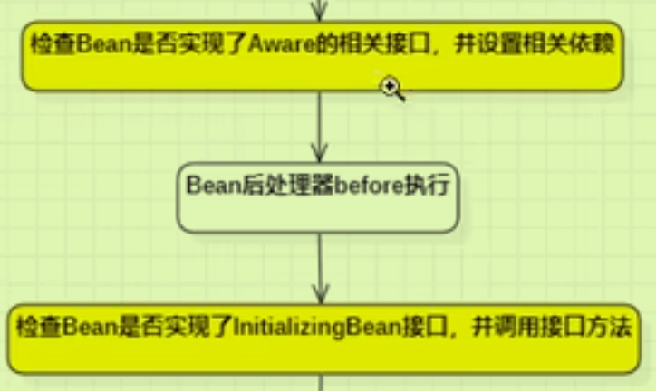
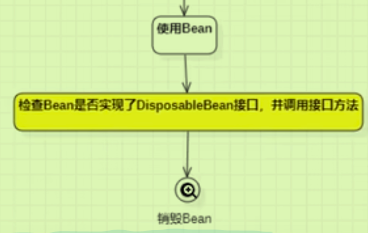
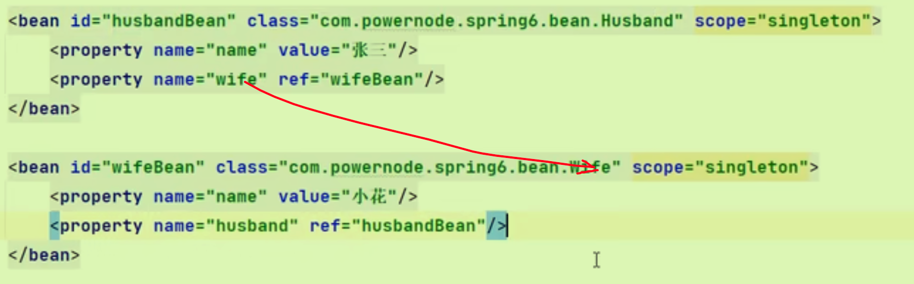

# Bean生命周期

## 粗略的五部曲

- 无参构造执行
- 给Bean对象的属性赋值
- 初始化Bean（需要自己写init方法）
- 使用Bean
- 销毁Bean（需要自己写destory方法），注意需要使用`.castvar`进行转型

不仅要手动写两个方法，还要手动在Bean中指定

## 七步曲

在第三步的前后插入代码。 **执行Bean后处理器的before、after方法**。

- 需要实现BeanPostProcessor接口
- 并实现其中的before和after两个方法。
- 这个Bean后处理器**作用于整个配置文件中**。

## 十步曲

在七步曲的基础上，bean处理器before方法前后+销毁Bean之前。





都在检查Bean是否实现了某些特定接口，以实现某些功能。

- 第一点，目的是为了传递数据方便使用——（如类的加载器，生产Bean的工厂对象，Bean的名字）
- 第二点，InitialBean接口
- 第三点，实现接口中的destory方法

在生命周期中插入更多的时机代码，为了方便在不同的时机使用Bean。

### 作用域不同，管理方式不同

Spring容器只对单例的Bean进行完整的生命周期管理，**如果是prototype，只负责初始化，客户端获得后Spring不再管理。（即最后两步不管了）**

## 自己new对象如何管理

- 获取factory对象
- 注册自己的Bean对象，将其纳入到Spring容器管理中

```java
DefaultListableBeanFactory factory = new DefaultListableBeanFactory();
factory.registerSingleton("studentBean", student);
```

# Bean的循环依赖问题

两个对象中相互引用对方。

## singleton下set注入（唯一解决）

Spring可以解决。原因：

- 1因为在**单例模式**下，Spring容器加载时，实例化Bean，实例化之后进行**提前曝光（不等属性赋值）**
- 2Bean曝光之后，再进行属性赋值。（set赋值）
- 

## prototype下set注入

如果两个都是prototype，每次创建新Bean就会要另一个Bean的对象，而另一个Bean对象也需要相应的Bean对象，会产生循环矛盾。

所以两个只要一个是Singleton即可。

## 基于构造注入

无法解决，实例化对象的过程是依据构造方法的，下面的属性赋值语句也要执行完才能够完成实例化对象（不会提前曝光）所以产生循环依赖矛盾。

## 底层原理

核心:分开*实例化Bean*以及*给Bean属性赋值*两个操作;两步操作**不要求在同一个时间点完成**。