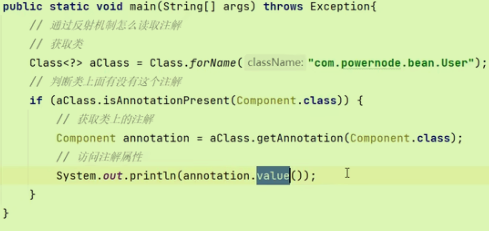
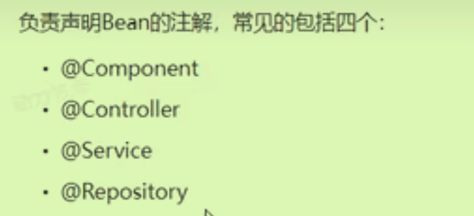
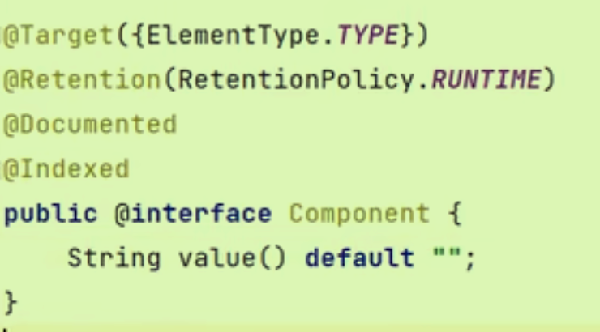
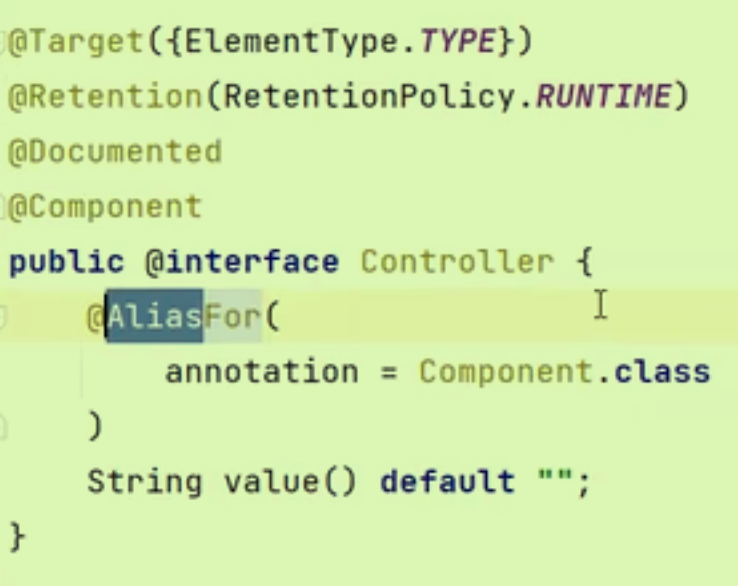
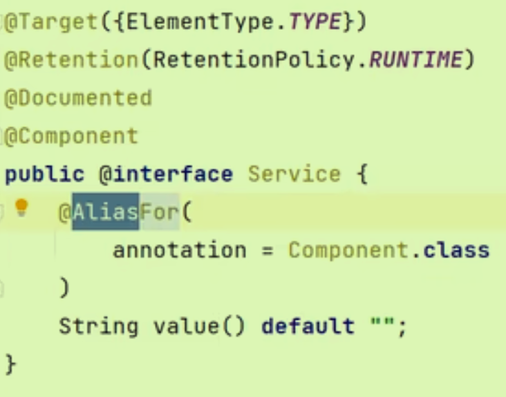
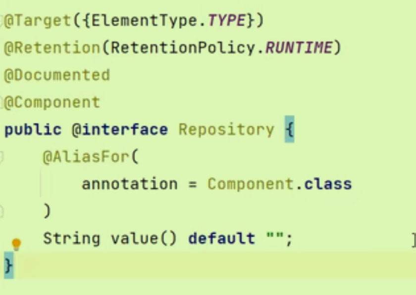
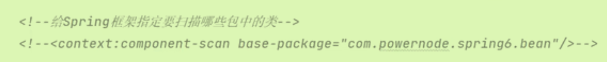
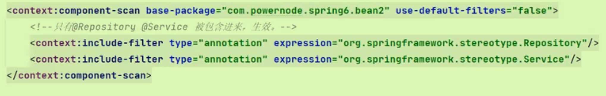
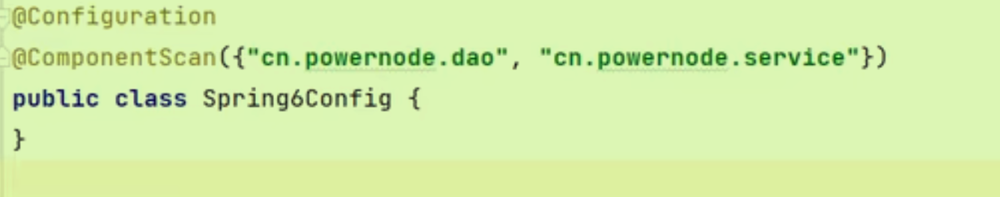

# 手写框架

## 回顾反射机制 

获取类-获取方法-调用方法（四要素）-

```java
Class<?> clazz = Class.forName("com.ltx.reflect.someService");
Method dosomeMethod = clazz.getDeclaredMethod("dosome", String.class, int.class);//后两个表征不同方法重载中的参数来区分方法
//哪个对象，哪个方法，什么参数，返回什么
Object obj = clazz.newInstance();
Object retValue = doSomeMethod.invoke(obj, "李四",250);//invoke返回值就是方法返回值

//根据属性名获取属性类型,先获取属性，再获取属性类型。
Field field = clazz.getDeclaredField(propertyName);
field.getType;
```

## 手写

先在框架的使用者角度准备一些类和配置Bean文件

再仿照之前使用时采用反射机制进行编写框架代码。

- 注意使用map集合存放Bean对象
- 注意使用dom4j来解析配置文件(SAXReader ->xml)
- 注意实例化Bean之后提前曝光。

# 注解开发

## 复习注解

如何定义注解

```java
@Target(value = {ElementType.TYPE, ElementType.FIELD})//元注解，用来修饰Component注解能够出现的位置
public @interface Component {
  //这是一个自定义的注解，可以在里面定义属性。
  //如果属性名是value，可以省略value
}
```

如何通过反射机制获取某个类上的注解，并访问注解的属性



 所以注解的作用就是标注并减少配置文件编程，读取某个注解就干什么，没有注解就不干。

代替了配置文件中的Bean标签等。

## 声明Bean注解



为了增加可读性，增加了后面三个注解，增强了程序的可读性（MVC三层使用）；其实四个都是第一个注解。

需要引入Spring-context依赖。

### Component



如果省略value值的声明，**默认起名类名首字母变小写**。

### Controller（表示层）



### Service（业务层）



### Repository（持久层）



## 使用声明Bean注解

四个步骤：**引入context依赖，配置文件中添加context命名空间，指定包的扫描， 使用注解获取Bean。**



### 扫描多个包

指定包的扫描时使用逗号隔开，也可以指定多个包共同的父包（效率不高）

### 选择性实例化Bean

- 可以将全部的Bean注解先失效，再挑需要生效的激活（`use-default-filters`默认值为true）
- 也可以全部生效，进行排除（`exclude-filter`）

## 负责注入的注解

上面的Component只是负责声明Bean，相当于只有一行Bean标签，而没有里面的属性代码。

所以接下来是负责对Bean对象属性赋值的注解。

*同样需要引入命名空间，打开组件扫描。*

### value注解

- 负责注入**简单类型** 。

- 既可以使用在属性上，也可以放在方法上（甚至可以放在构造方法的形参中）

### Autowired注解

- 负责非简单类型注入
- 单独使用**默认根据类型装配**，如果想根据名字装配要*联用Qualifier*（用来指定名字）
- 不需要指定任何属性，直接使用即可。（自动装配）
- 如果有多个相同类型（实现的是同一接口）光用autowired就不行了。

### Resource注解

也可以完成非简单类型注入（官方建议使用）

需要引入第三方依赖（jakarta） 

- 根据名称进行装配，未指定name时，使用属性名作为name；name找不到的话根据类型进行装配
- 只能为**属性和set方法**注解。

## 全注解式开发

使用一个类代替配置文件。



测试中的使用代码也要更改：

 