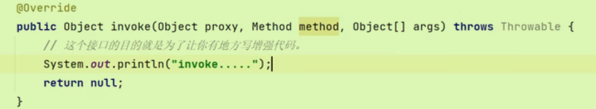
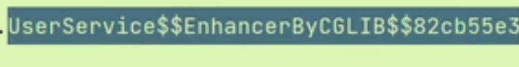
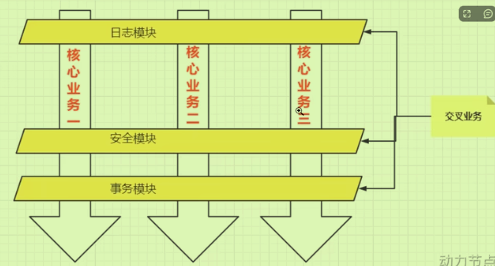
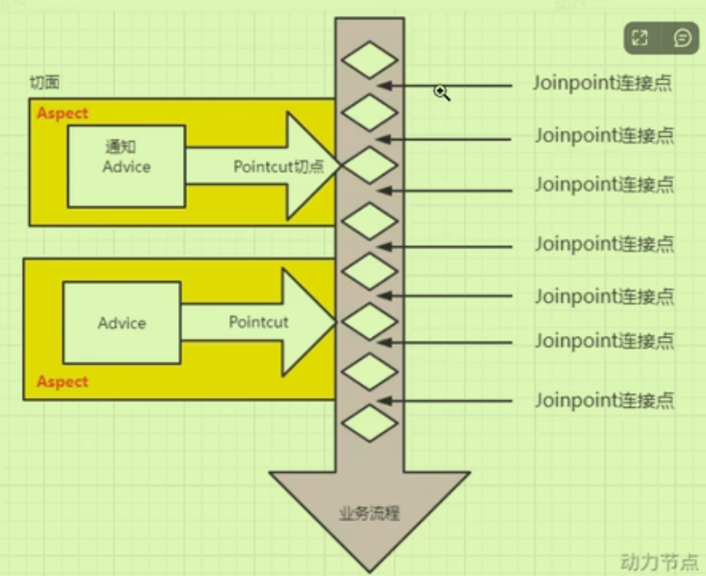
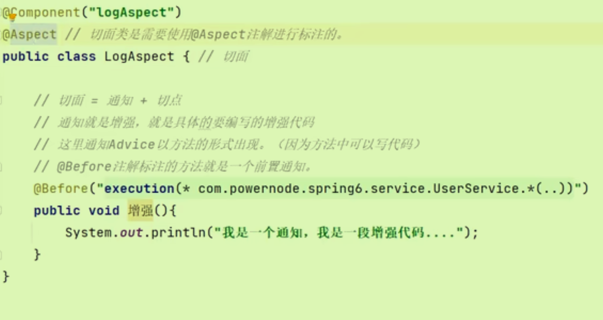
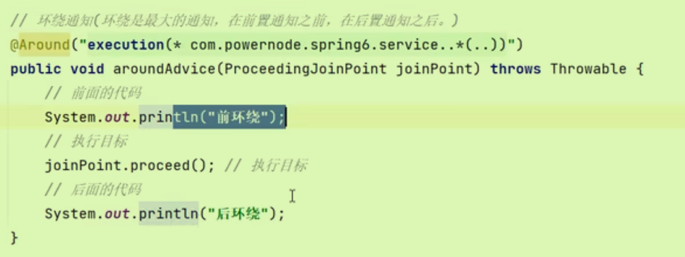
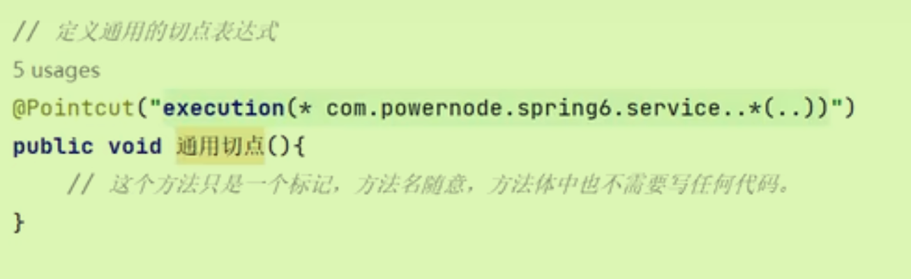
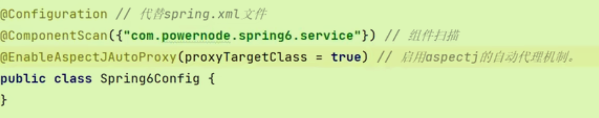
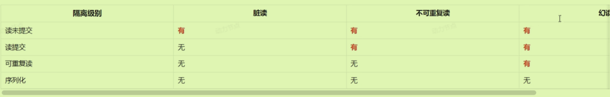
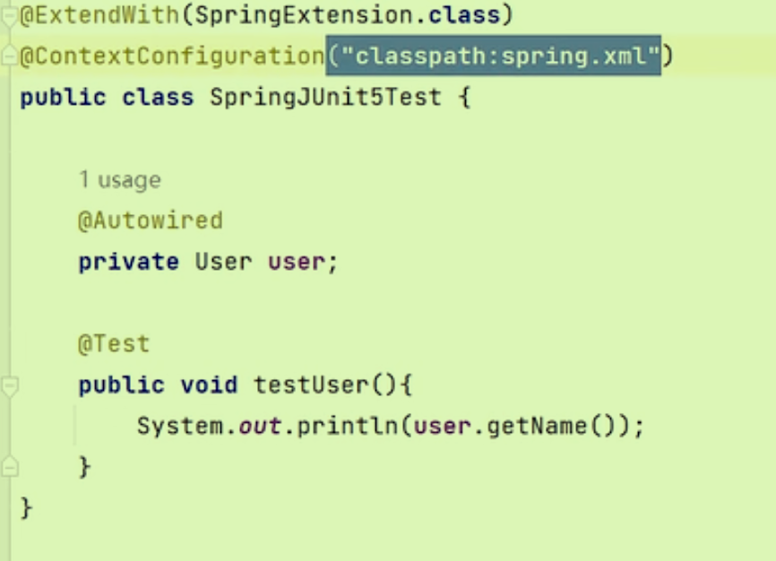

# 代理模式（AOP关键）

## 简述

属于结构型设计模式。 

- 代理主要用于在不修改目标对象（如业务组件）代码的情况下，为其添加额外的行为（比如日志记录、事务管理等

- 代理对象在运行时创建，并在调用目标对象的过程中插入横切逻辑。

代理作用：

- 对象需要被保护
- 对象需要增强功能
- 两个对象无法直接交互时，可以使用代理模式来辅助交互

三大角色（其实还有客户端）

- 目标对象
- 代理对象
- 目标对象和代理对象的**公共接口**（二者应具有相同的行为动作，因为不想被客户端知道是代理）

## 静态代理

将目标对象作为代理对象的一个*属性*，这种关系叫做**关联关系**（耦合度比继承要低）关联<泛化

但是要注意，属性的声明要用公共接口去声明（降低耦合）

```java
private OrderService target;//目标对象，但是是公共接口类型，向上转型多态。
//创建目标对象
OrderService target = new OrderServiceImpl();
//创建代理对象
OrderService proxy = new OrderServiceProxy(target);
//调用代理对象的代理方法
proxy.generate();//实际上generate里面也调用了目标对象中的方法（就像是在使用目标对象一样）
```

但是要增加的类太多了，所以需要动态代理自动生成（防止类爆炸）

## 动态代理

内存中动态生成代理类。

### JDK动态代理

**只能代理接口**

不用去写那个代理类而是使用jdk动态代理的方法

```java
OrderService target = new OrderServiceImpl();
//创建代理对象
//在内存中动态生成一个代理类的字节码，实例化了代理对象
Object proxyObj = Proxy.newProxyInstance(target.getClass().getClassLoader(),
                                         target.getClass().getInterface(),
                                         new TimerInvovationHandler())；//三个参数
```

- 类加载器：JDK要求目标类的类加载器必须和代理类使用同一个
- 代理类和目标类要实现同一接口
- 调用处理器：在调用处理器接口中**编写增强代码**，自己写处理器接口的实现类（写一次就好）

调用处理器的类：

自己写这个实现类TimerInvocationHandler  

invoke方法是JDK底层自动调用的，当代理对象调用代理方法时，注册在处理器当中的invoke自动被调用。

- Proxy:是代理对象的引用
- Method method 目标对象上的目标方法（就是要执行的）
- Args:目标方法上的实参

需要**在invoke中调用目标方法**

```java
Object retValue = method.invoke(目标对象target, args);
```

最后总的TimervocationHandler类的写法：

```java
package com.powernode.mall.service;

import java.lang.reflect.InvocationHandler;
import java.lang.reflect.Method;

/**
 * @author 动力节点
 * @version 1.0
 * @className TimerInvocationHandler
 * @since 1.0
 **/
public class TimerInvocationHandler implements InvocationHandler {
    // 目标对象
    private Object target;

    // 通过构造方法来传目标对象
    public TimerInvocationHandler(Object target) {
        this.target = target;
    }

    @Override
    public Object invoke(Object proxy, Method method, Object[] args) throws Throwable {
        // 目标执行之前增强。
        long begin = System.currentTimeMillis();
        // 调用目标对象的目标方法
        Object retValue = method.invoke(target, args);
        // 目标执行之后增强。
        long end = System.currentTimeMillis();
        System.out.println("耗时"+(end - begin)+"毫秒");
        // 一定要记得返回哦。
        return retValue;
    }
}
```


### CGLIB动态代理技术

基于**类**的代理方法。

底层是通过**继承**的方式实现，*既可以代理接口又可以代理类*。

以前手写的时候要写子类继承目标类，现在CGLIB技术自动生成子类：

# 面向切面编程AOP

 和业务逻辑不挂钩的非业务逻辑代码，单独提取出来。（各种记录日志，计时等**事务代码**，称为**交叉业务**）

代码更加精简，复用度更高，更加专注于业务代码。（业务是纵向的，无关的是横向，切面）



Spring的动态代理技术就体现了AOP编程。

## 七大术语

1、JoinPoint连接点

- 在整个程序执行过程中，可以植入切面的**位置**
- 连接点直接对应于业务方法

2、Pointcut切点

- 定义了哪些连接点应该被拦截
- 一个切点对应多个连接点

3、Advice通知

- 具体增强的代码（交叉业务的代码），本质是**代码**
- 根据通知放在不同的连接点上，分为前置，后置，环绕，异常，最终通知。

4、Aspect切面

- 切点+通知（在哪个业务附近切入的什么代码）



5、目标对象

- 被一个或者多个切面所通知的对象

6、织入

- 将切面应用到目标对象并导致代理对象创建的过程

7、代理

## 切点表达式

定义通知往哪些方法上植入。

`execution([访问控制权限修饰符] 返回值类型 [全限定类名]方法名(形式参数列表) [异常])`[ ]为可选项

- \* 表示返回值类型任意。
- 两个点“..”代表当前包以及子包下的所有类。
- *表示所有方法。
- (..) 参数类型和个数随意的方法;(*) 只有一个参数的方法

```java
// 定义一个切面=切点+建议
@Aspect
@Component
public class LoggingAspect {

    // 定义一个切点，所有名为 'dbOperation*' 的方法都将成为该切点的一部分
    @Pointcut("execution(* com.example.service.*.dbOperation*(..))")
    public void databaseOperations() { }

    // 建议（Advice）应用于切点
    @Before("databaseOperations()")
    public void logBeforeDbOperation(JoinPoint joinPoint) {
        System.out.println("即将执行数据库操作: " + joinPoint.getSignature().getName());
    }
}
```


## Spring的AOP

借助了另一个框架AspectJ ，底层原理还是JDK接口代理或者CGLIB代理。

#### 切面类如何编写：

通知（增强）利用注解分类，里面的切点表达式包括了切点。

- AfterReturning后置通知；Around环绕通知；AfterThrowing异常通知（catch）；After最终通知（finally)



- 注意环绕通知的方法中需要有参数joinPoint:

- 不同切面之间的顺序，在切面类上面使用**Order注解**`@Order(1)`,谁的数字越小优先级越高

#### 通用切点表达式



跨类需要写全限定类名。

#### 连接点JoinPoint

可以作为通知的参数，在Spring调用这个方法时自动传过来，可以使用其获取一些信息。

```java
joinPoint.getSignature();//获取目标方法的签名
```

#### AOP全注解开发

如果不全注解，**在spring.xml配置中开启自动代理**，检查类上面有没有Aspect注解，如果有则给这个类生成代理对象。

如果全注解开发就新建一个配置类：

### AOP事务

### AOP安全

# Spring对事务支持

底层还是基于AOP实现，对其进行了二次封装。

开启事务-执行核心业务逻辑-提交事务（无异常）-回滚事务（有异常）

Spring采用声明式事务——基于注解或者XML配置方式。

### 事务管理器接口

PlatformTransactionManager

PlatformTransactionManager接口：spring事务管理器的核心接口。在**Spring6**中它有两个实现：

- DataSourceTransactionManager：支持JdbcTemplate、MyBatis、Hibernate等事务管理。
- JtaTransactionManager：支持分布式事务管理。

需要在配置文件中配置。命名空间改为tx，并告诉spring开启事务注解驱动器：`@Transactional`


### 注解属性

#### Propagation传播行为

用来表示不同方法上**不同事务之间的关系**。（如果a方法执行时调用了b方法）以枚举类型存在。

- 默认Required，没有就新建，有就加入
- Required_New,直接开启一个新事务，不存在嵌套关系。

#### isolation隔离级别

多事务并发防止互相干扰；不同的隔离级别多事务之间的墙厚度不同（脏读、不可重复读、幻读）



- Mysql默认级别是Repeatable_Read(4)
- Oracle默认是Read_Commited(2)

#### timeout超时时间

如果在这段时间内该事务中的**所有DML语句还没有执行完毕的话**（最后一条DML语句+之前的时间），选择回滚。

#### readOnly只读事务

优化select语句效率

#### rollbackFor回滚与否


## 全注解开发事务

```java
@Configuration
@ComponentScan("com.powernode.bank")//组件扫描器
@EnableTransactionManagement//开启注解事务
public class Spring6Config {//new AnnotationConfigApplication(Spring6Config.class)

    @Bean
    public DataSource getDataSource(){
        DruidDataSource dataSource = new DruidDataSource();
        dataSource.setDriverClassName("com.mysql.cj.jdbc.Driver");
        dataSource.setUrl("jdbc:mysql://localhost:3306/spring6");
        dataSource.setUsername("root");
        dataSource.setPassword("root");
        return dataSource;
    }

    @Bean(name = "jdbcTemplate")
    public JdbcTemplate getJdbcTemplate(DataSource dataSource){
        JdbcTemplate jdbcTemplate = new JdbcTemplate();
        jdbcTemplate.setDataSource(dataSource);//要使用上面的数据源，加入dataSource参数进行自动注入
        return jdbcTemplate;
    }

    @Bean
    public DataSourceTransactionManager getDataSourceTransactionManager(DataSource dataSource){
        DataSourceTransactionManager dataSourceTransactionManager = new DataSourceTransactionManager();
        dataSourceTransactionManager.setDataSource(dataSource);
        return dataSourceTransactionManager;
    }

}
```

# Spring对JUNIT5支持

在配置文件中引入相关依赖，再进行注解配置：



