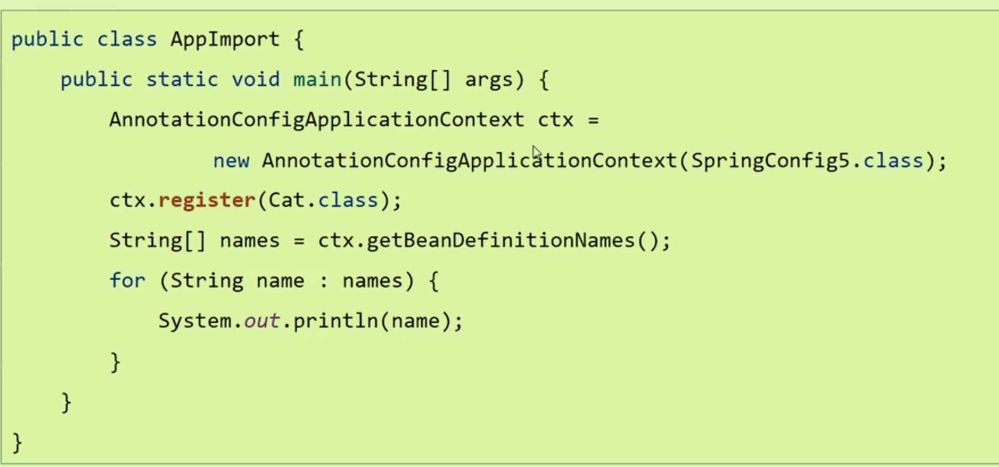
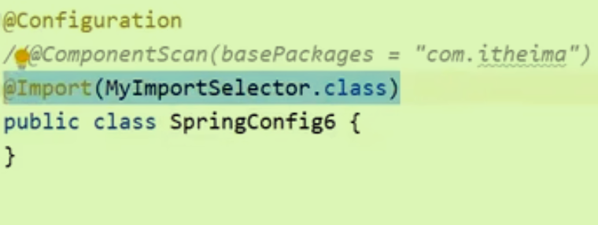
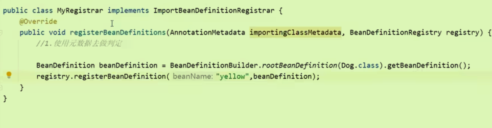
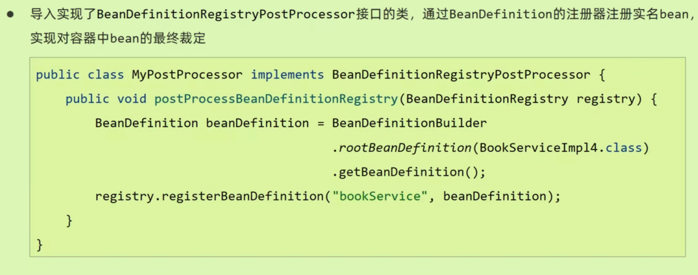
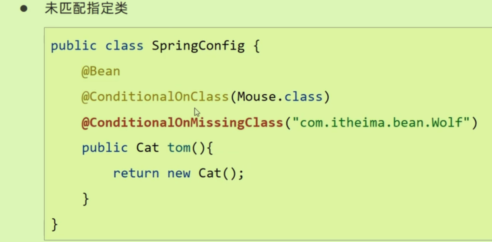

# Bean的初始化方式

## 1XML方式

在XML文件中使用Beans标签进行配置

```xml
<beans>
    <bean id="myBean" class="com.example.MyBean" />
</beans>

```

使用时使用上下文来进行获取。

```java
ApplicationContext context = new ClassPathXmlApplicationContext("path/to/applicationContext.xml");
MyBean myBean = context.getBean(MyBean.class);
```


## 2XML+注解配置

元素指示Spring在指定的包（在这个例子中是`com.itheima`）及其子包中自动查找带有Spring组件注解的类（比如`@Component`, `@Service`, `@Repository`, `@Controller`）并注册为Spring容器中的Bean

使用**包扫描器**

```xml
<?xml version="1.0" encoding="UTF-8"?>
<beans xmlns="http://www.springframework.org/schema/beans"
       xmlns:xsi="http://www.w3.org/2001/XMLSchema-instance"
       xmlns:context="http://www.springframework.org/schema/context"
       xsi:schemaLocation="http://www.springframework.org/schema/beans
                           https://www.springframework.org/schema/beans/spring-beans.xsd
                           http://www.springframework.org/schema/context
                           https://www.springframework.org/schema/context/spring-context.xsd">

    <context:component-scan base-package="com.itheima" />

</beans>

```

## 3注解方式+JAVA配置类

配置类扫描取代了xml中的扫描

```java
@Configuration
@ComponentScan("com.itheima")
public class SpringConfig{
  @Bean
  public DruidDataSource getDataSource(){
    DruidDataSource ds = new DruidDataSource();
    return ds;//将这个方法的返回值作为一个Bean交由Spring管理
    //每个这样的方法都会返回一个对象，该对象会被注册为一个Bean。
  }
}
```

获取Bean,注意不同于上面的ClassPath而是使用Annotation

```java
ApplicationContext ctx = new AnnotationConfigApplicationContext(SpringConfig.class);
String[] names = ctx.getBeanDefinitionNames();
```

## 4Import方式直接导入

导入的是**全路径名**。

```java
@Configuration
@Import(AnotherConfig.class)
public class AppConfig {
    // ...
}

```

## 5使用上下文对象在容器初始化后注入Bean



## 6优化Import增加选择条件



使用ImportSelector接口

```java
public class MyImportSelector implements ImportSelector{
  public String[] selectImports(AnnotationMetadata metadata){//注意参数是元数据
    boolean flag = metadata.hasAnnotation("org.springframework.context.annotation.Import");
    if(flag){
      return new String[]{"com.itheima.domain.Dog"};
      }
    }
  return new String[]{"com.itheima.domain.Dog"};
  }
}
```

## 7更加高级registry

BeanDefinitionRegistry深入到Bean的定义过程中。



## 8注册完后进行顺序裁定



# Bean的加载控制

## 编程控制

后四种加载Bean的方式都可以利用编程的形式进行控制。

## 注解控制

可以按照类型、Bean名称进行匹配。

