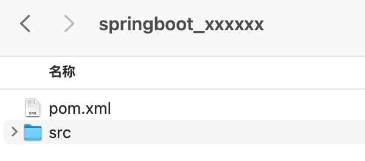
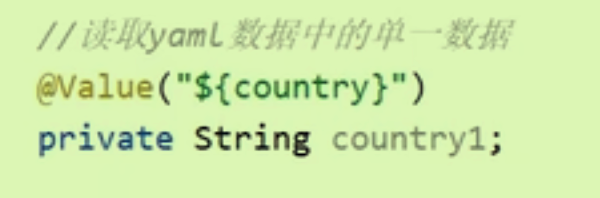
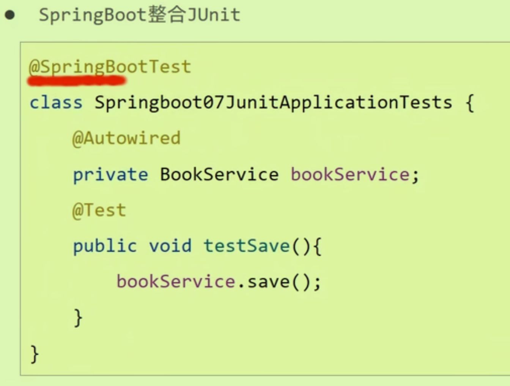
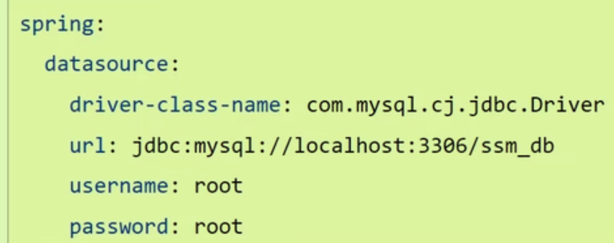

## 入门案例解析

### 仓库版本管理（起步依赖）

SpringBoot为我们定义了一系列的常用坐标版本和常用坐标组合，我们直接使用这些组合就可以了，避免了多种技术融合时的不兼容。

在pom.xml文件中的这段代码：*你的项目会自动继承这些依赖的推荐版本，无需在项目的pom.xml中显式声明依赖版*

```xml
    <parent>
        <groupId>org.springframework.boot</groupId>
        <artifactId>spring-boot-starter-parent</artifactId>
        <version>3.2.3</version>
        <relativePath/> <!-- lookup parent from repository -->
    </parent>
//并且下面依赖的导入也使用到了依赖传递,starter对应着一系列依赖
        <dependency>
            <groupId>org.springframework.boot</groupId>
            <artifactId>spring-boot-starter-web</artifactId>
        </dependency>
```

也可以采用引入依赖的形式完成（阿里云）

#### parent

- 依赖管理，而非依赖。

- 减少依赖冲突

#### starter

- 决定是否使用依赖。
- 减少依赖配置。

每个starter都包含了一个或多个相关技术的默认版本库依赖，这意味着开发者只需添加一个starter依赖到项目中，就能获取到所有必需的库。

### 引导类

整个Boot工程的执行入口，初始化Spring容器，扫描包（注意类的路径）

run方法底层还是Spring容器。

```java
@SpringBootApplication//这个注解代码里包含了配置文件和扫描包
public class SpringbootDemo02Application {

    public static void main(String[] args) {
        ConfigurableApplicationContext rongqi = SpringApplication.run(SpringbootDemo02Application.class, args);
        BookController bookControllerBean = rongqi.getBean(BookController.class);
    }

}
```

### 内嵌Tomcat

将Tomcat包成一个对象，交给Spring去管理。


## 基础配置

### 备份副本，模版



模版形式如上，**注意将pom中的artifactId改为模块名称**。

### 修改配置

在resources/application.properties下进行KEY-VALUE的设置。

例如修改浏览器的默认端口`server.port = 80`可以做到直接使用`http://localhost`访问，因为80是Http协议默认使用的端口号

但是，这里面的**配置也与对应的starter**依赖息息相关。

### 3种配置格式

- Properties,yml,yaml；优先级也是这个顺序（处于相同配置时）

- 推荐使用**yml格式**。YAML文件有两个扩展名.yml.yaml

### YAML格式

- 属性：空格 值（这个空格很重要）
- 读取YAML中的数据
- 引用文件中已存在的属性`${xxx}`；如果出现转义字符使用双引号包装
- 使用`@Autowired`自动装配将所有数据装到一个对象Environment中，使用`getProperty方法获取值`

#### 主流读取配置方式

1、在yml中将一堆配置信息封装为一个对象；

2、在外面提供对应的模型类（通过`@ConfigurationProperties(prefix="xxx")`注解进行联系


## 整合第三方技术

### JUNIT



SpringBootTest注解的classes属性可以精准指定引导类（配置类）的位置——**测试类需要在引导类所在的包或者子包中。**

### Mybatis

- 勾选Mybatis和MysqlDriver依赖（注意starter发生了变化）

- 配置必要信息：