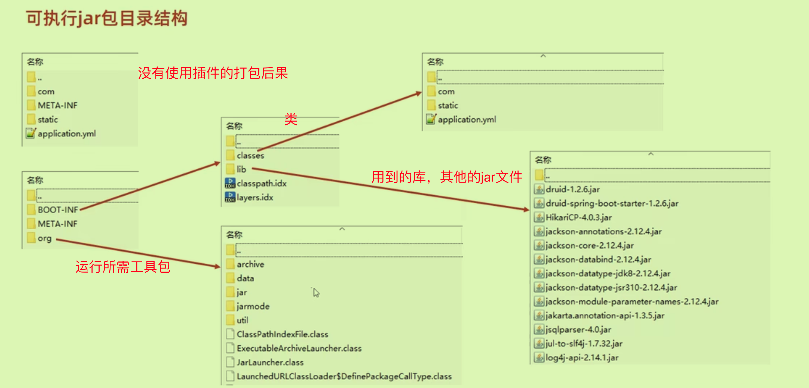

## 打包启动

将写好的程序打jar包，放在服务器上运行:

从Maven中打包时，可以**跳过测试**环节：

### Boot程序jar包结构

必须要有maven插件。



jar启动器和主启动类配合运行boot文件。

#### 端口问题

如果遇到端口占用，

- 使用`netstat -an`去查看所有端口;

- 使用`netstat -an | grep 8080`去查看特定端口如8080


## 配置高级

### 属性

使用临时属性覆盖原先属性,在命令行中例如：

`java -jar springboot.jar --server.port=8080`

可以使用`空格--`来加上更多临时属性

在IDEA中添加临时属性：**其实进入了arg数组中**


#### 本质

在启动程序中的run方法中参数决定了是否带有属性

`SpringApplication.run(SSMApplication.class, arg)`可以不要arg或者自定义arg

### 配置文件优先级


多层级配置文件间的属性采用叠加并覆盖的形式（没有的叠加，有的被高级别覆盖）

#### 自定义配置文件

可以通过定义Config按钮来指定name或者classpath来指定配置文件

## 多环境开发

设置环境-公共配置

使用`---`来分割不同环境


放在一个文件中不够灵活

### 多文件版


### 分组管理


加载顺序也是从主环境开始dev-devDB-devRedis-devMVC

### Maven控制Boot的多环境


使用@@来进行引用Maven中配好的属性

## 日志操作

### 基础操作

日志有不同的级别，只会显示级别与高级别的信息。


可以在配置文件中设置日志级别

```yaml
logging:
	#设置分组
	group:
	 ebank: xxx
	 iservice: yyy
	#设置级别
	level:
		root: debug
		com.ltx.controller: info #设置某个包的日志级别
		ebank: warn

```

基于lombok提供的@Slf4j注解可以为类快速添加日志对象，不用对每一个controller都去new日志对象了。

### 设置日志消息格式

