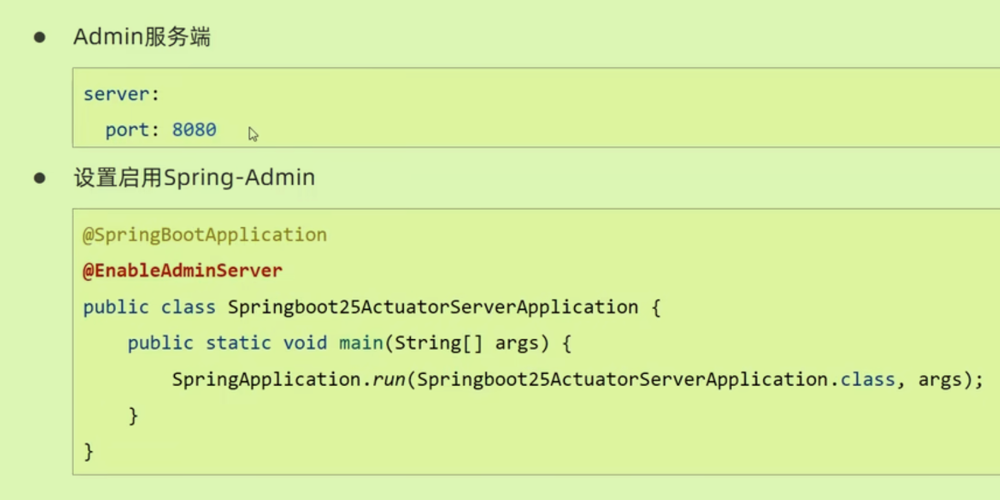

# 开发实用篇

## 热部署


Build->Build Project

热部署仅仅加载自定义开发资源，不加载jar资源

###  哪些参与热部署

默认全参与。

在配置文件中设置


## 配置高级

### Bean属性绑定

**将配置属性绑定到POJO上**

使用`@ConfigurationProperties`不仅可以为自己写的进行Bean属性绑定，也可以为第三方Bean绑定属性

```java
@Bean
@ConfigurationProperties(prefix = "datasource")
public DruidDataSource dataSource(){
  DruidDataSource ds = new DruidDataSource();
  return ds;
}
```


### 松散绑定

注解中，`@ConfigurationProperties`支持松散绑定：即自己写的java配置类中的属性可以与配置文件中的不大相同——*意味着在配置文件中的属性名不必与Java Bean中的字段名完全匹配*

但是`@Value`就不支持。

注意，**绑定前缀名称**有要求：只能使用小写字母，数字，中划线

### 常用计量单位

时间和存储空间单位


### 数据校验

#### Bean属性校验


2、开启校验功能

- `@Validated`

3、Bean中具体字段上指定具体的规则

-  

注意**yaml格式中int类型支持进制**，所以如果输入0127会识别为八进制数，如果是密码就要加引号表示字符串——纯字符串建议使用引号包裹

## 测试应用

### 加载测试专用属性

只在某个测试类中有效，不影响其他测试

- `@SpringBootTest(properties = {"test.prop=testValue"})`

- `@SpringBootTest(args = {"--testValue2"})`

### 加载测试专用配置（Bean）


### web环境模拟测试

定义一个需求，进行一个匹配——状态、结果、响应体、响应头

在`@SpringBootTest`的参数中使用`webEnvironment`启用web环境测试；

开启虚拟的MVC调用`@AutoConfigureMockMvc`；注入虚拟MVC调用对象；再创建虚拟请求


### 匹配响应状态、执行结果


### 匹配响应体

使用`content.json`即可

### 业务层测试

平时的测试会往实际数据库中添加数据，所以需要别的方法来测试——关闭其事务：在测试类上使用`@Transactional`注解。

并且测试用例可以使用随机值：在配置文件中设置。

## 数据层应用

### 数据源


HikariCP是默认数据源

### 持久化解决方案

JDBCTemplate是Boot内置的

### 数据库

内置了三种数据库（内存级的数据库）


### Nosql解决方案

#### Redis

通过**RdisTemplate对象**调用对应的操作api，api再调用set，get方法；以对象为key-value进行操作

#### Mongodb

无模式的文档型数据库，适用于变化较快且不需要放入数据库中的数据。

### ES（Elasticsearch）

支持分布式，全文搜索能力。

SpringBoot中整合Highlevel版本，导入坐标后无需配置（因为Boot没有整合）所以不能自动注入需要手动new客户端

```java
@Test
void testSearch() throws IOException {
  SearchRequest request = new SearchReques("books");
  SearchSourceBuilder builder = new SearchSourceBuilder();
  builder.query(QueryBuilders.termQuery("all","java"));//要去查询的字段
  request.source(builder);
  //以上的都是设置条件
  SearchResponse response = client.search(request, RequestOptions.DEFAULT);
  //得到所有的命中结果，每个命中结果都是我们所要的结果
  SearchHits hits = response.getHits();
  for(SearchHit hit: hits){
    String source = hit.getSourceAsString();
    Book book = JSON.parseObject(source, Book.class);
  }
}
```

## 整合第三方技术

### 缓存

不仅可以提高数据库的读取效率，还可以提高一些临时空间的利用

#### 内置缓存

SpringBoot内置了缓存技术Simple：先设置对应的starter，再使用`@EnableCaching`注解*在启动类启用缓存*；在对应的*方法*上使用`@Cacheable`注解来使用缓存。

#### 整合其他缓存

##### Ehcache

导入坐标，导入技术对应的配置文件（可以设置不同的缓存策略），在主配置文件中设置缓存使用该技术；不需要更改接口（Boot统一了接口）

##### Redis

导入坐标、主配置中设置为Redis

##### XMemcached

Boot没有对应的整合方案，需要像上面的配置那样**封装为Bean加载**，再创建客户端配置类——使用这个Client对象进行GetSet处理。


#### jetCache

基于SpringCache进行封装，是一个框架的整合框架。

远程用来共享，本地用来减轻远程压力。 

在启动类上添加`@EnableCreateCacheAnnotation`注解

##### 远程缓存方案

使用**Redis**：

类比Sample，导入相关坐标，配置写在配置文件中，再用注解开发：

使用注解来创建一个缓存实例——缓存区域名、缓存实例名称前缀、过期时间

`@CreateCache(area="sms", name="jetCache_",expire = 10,cacheType = CacheType.BOTH)`

Cache类型的默认值是远程类型。

`Private Cache<Long, String> cache;`

`Cache.put() Cache.get()`

##### 本地缓存方案

使用**LinkedHashMap**


##### 方法缓存

上面的写法都是在服务或者组件中的设置，现在想要在方法上使用缓存。

- 在启动类上开启方法缓存`@EnableMethodCache(basePackages="包名")`

- 在方法上使用`@Cached(name="book",key="#id",expire = 10)`，还有CacheUpdate\CacheInvalidate\CacheRefresh等操作
- 采用远程方案时需要序列化，在配置中添加`      valueEncoder: java      valueDecoder: java `以保证数据正确在Redis上传输

#### j2cache

用于配置多级缓存，需要配置对应的缓存以及其配置文件。

多级缓存数据交换，使用的是Redis中的技术。


使用时注入CacheChannel对象，使用其setget方法。

## 任务

### 定时任务

Task+Time

#### Quartz

以下为了解内容

Job+JobDetail+Trigger+Scheduler

```java
//创造一个工作类，不需要定义为Bean
public class MyQuarts extends QuartzJobBean{
  @Override
  protected void executeInternal(JobExecutionContext context) throws JobExecutionException{
    //
  }
}
```

设置配置类：

**触发器绑定工作明细，工作明细指定工作**


将工作包装为工作明细；新建触发器然后绑定（forJob)工作明细

#### Task

Spring对其进行优化整合，只需要在启动类开启定时执行的开关，`@EnableScheduling`，在对应的工作（由Spring管理的）上添加`@Scheduled`注解来设置定时执行

还可以对定时任务进行相关的配置Spring-Task

### JavaMail

#### 简单邮件

配置JavaMail，在实现类中定义必要信息（标题，正文等），再注入自带的JavaMailSender对象，使用sendMail方法进行传输


#### 复杂邮件


## 消息队列（异步）

任务都可以转换为消息 

AMQP规范了消息传递交换的格式，JMS规范了消息该如何传递。

JMS消息模型分为**点对点模型和消息订阅模型**（可以有多个消费者）

以下都是AMQP，兼容JMS，实现MessageService接口。

### ActiveMQ

坐标-配置-调用接口 


接收消息时可以进行监听，可以立即处理消息。（而不是图里的这种）

### RabbitMQ 

分为直连交换机模式，topic交换机模式

#### 直连模式

在convertAndSend时需要指定交换机，所以我们得建立配置类来写好交换机。


与交换机连接，通常是一个交换机，多个消息队列。


#### Topic模式

队列连接交换机时存在一个匹配规则，可以指定哪个队列的消息到交换机上。


### RocketMQ


建议先配置环境变量NAMESRV_ADDR


## 监控

监控信息，被监控者提交自己被监控。

### SpringBootAdmin 

从服务端配置

设置为web项目，设置对应的注解。



从客户端配置

开放所有的信息项给服务端看


监控客户端利用Actuator来管理不同的端点(endpoints)，不同的端点代表着客户端的不同状态信息——即上面的exposure中的东西。

#### info端点

展示某客户端程序的信息，自定义动态信息写成一个类交给Spring管理


#### health端点

标志着项目中的组件是否正常运行。

自定义组件信息，注意**标记组件的状态**。


#### 自定义端点

