## 微服务架构

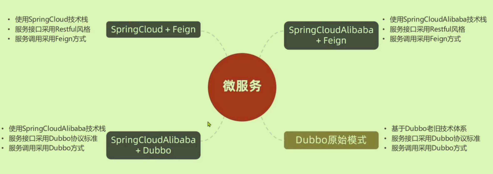

### 整合各种功能

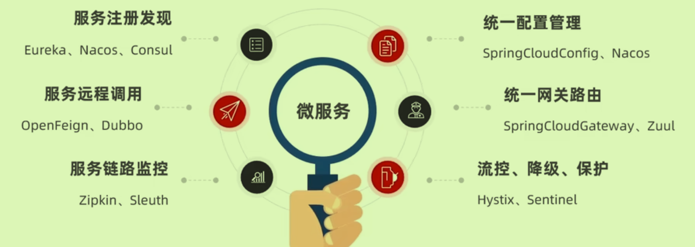

## 微服务流程

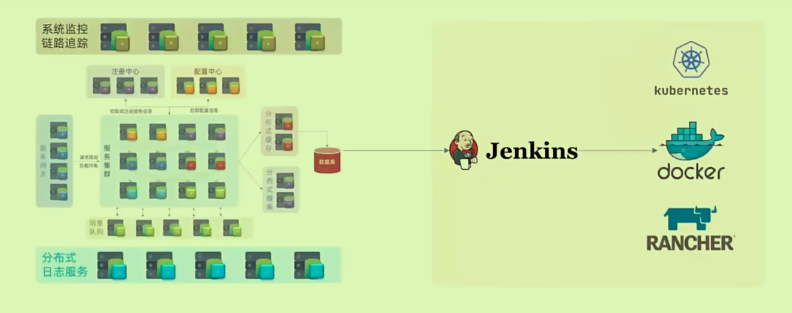

### 服务拆分

- 一个服务既可以是提供者，又可以是消费者

### 远程调用

某个服务要调用另一个服务，就是向其发送一次Http请求。

- 在启动类中注入一个Bean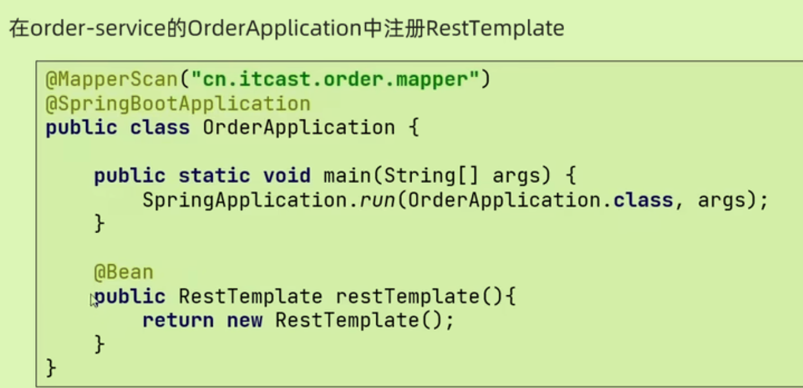

- 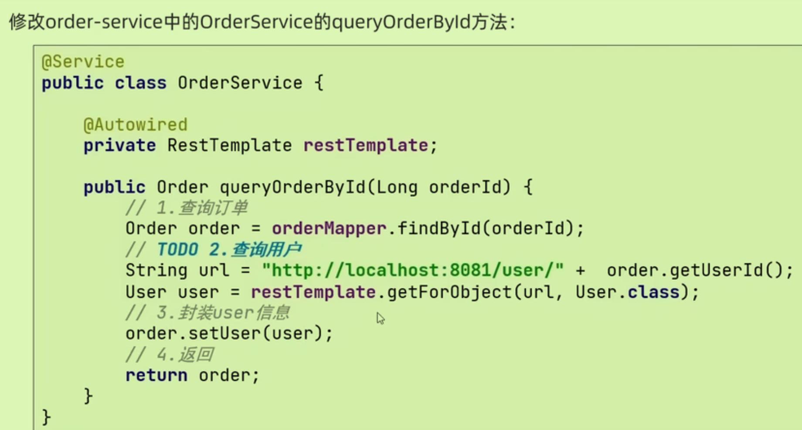

### Eureka注册中心

- Eureka Server 负责维护服务的注册表和提供服务发现机制，而客户端则负责注册服务、维护心跳、以及查询服务。
- Eureka自己也是一个微服务，启动时也要将自己注册到Eureka上。

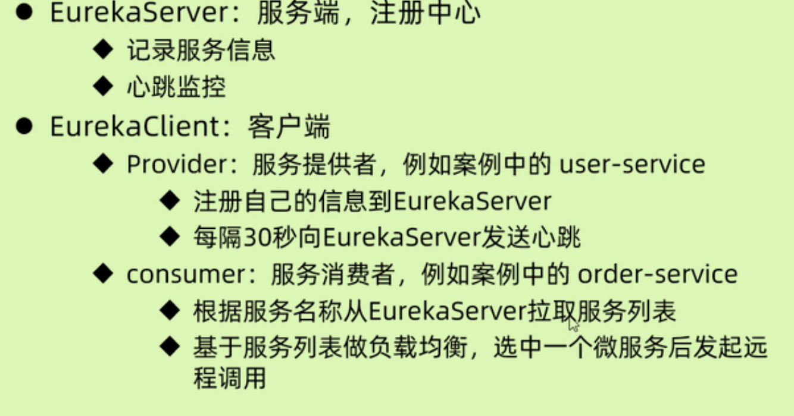

- 服务注册具体操作：引入client依赖，在pom.xml文件中进行eureka地址配置。
- 服务发现具体操作：给RestTemplate添加`@LoadBalanced`注解(负载均衡），用服务提供者的服务名称进行远程调用（代替了IP和端口）

### Ribbon负载均衡

#### 流程

大体流程

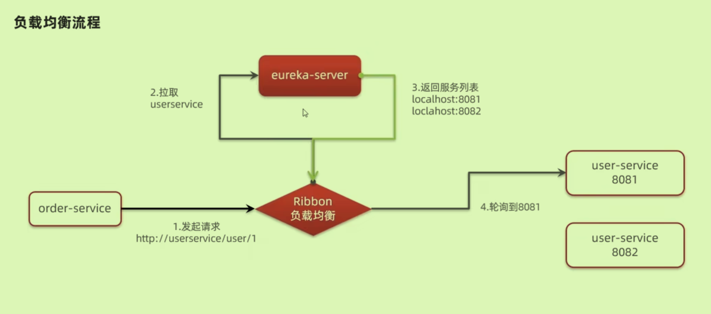

详细源码级别流程：Ribbon得到**服务名称**去eureka里服务列表找到相应服务**具体地址**替换之前的请求。

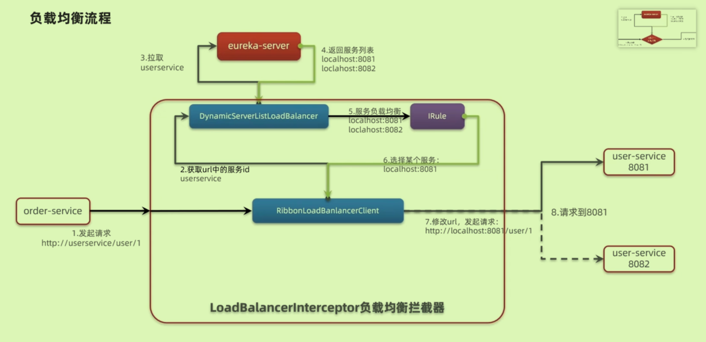

#### 负载均衡策略

默认为ZoneAvoidance

#### 饥饿加载策略

默认采用懒加载，**第一次访问时才会去加载**`LoadBanlancerClient`，导致第一次耗时较长；

饥饿加载配置后，在项目启动时就会去加载，省时效果。

### Nacos服务注册中心

阿里下的更为强大的Eureka

#### 服务分级存储模型

将相同机房中的服务作为一个**集群**。

#### NacosRule负载均衡

大前提还是Ribbon，只是修改Ribbon的负载均衡策略为`NacosRule`，优先访问本地集群（没有才会去其他集群）

对于本地集群，对于不同的服务还可以设置优先级——控制台设置权重值

#### 环境隔离

对于不同的**生产环境**，再对服务进行划分（之前已经用集群划分过一次了）；默认为public

**不同环境下的服务相互不可见**

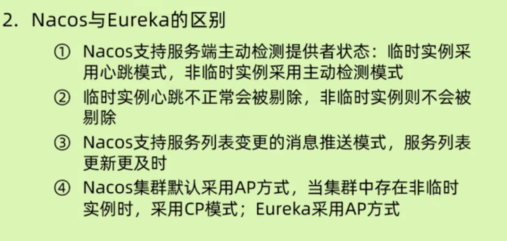

## Nacos进行配置管理

### 作用

为了实现服务配置的热更新（更改配置不用牵一发而动全身且重启）

故配置内容通常是**需要热更新的配置内容**。`[服务名称]-[profile].yaml`

### 微服务获取Nacos配置信息

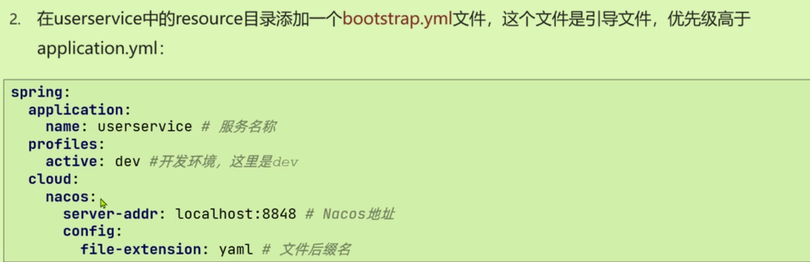

### 实现配置自动刷新

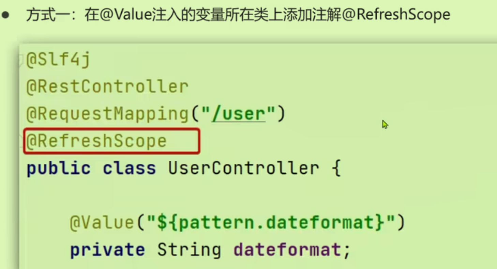

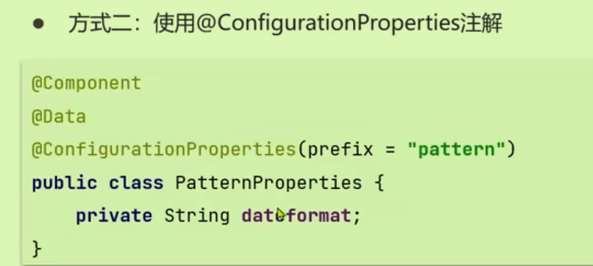

更推荐方式二。

### 多环境配置共享

将相同的配置放在多环境共享中。

配置优先级：带环境的->多环境共享的->本地配置

### Nacos集群（常用）

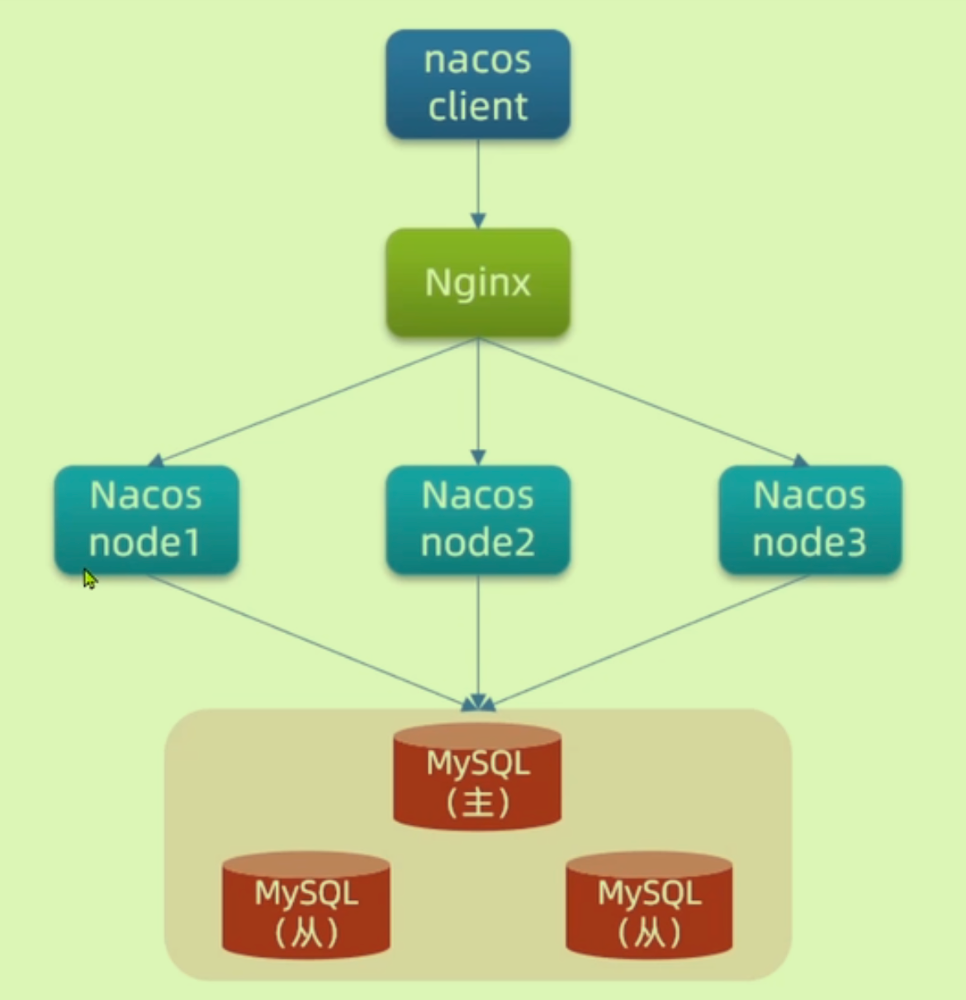

## http客户端Feign

### 使用Feign

代替RestTemplate,是一种声明式编写，将声明的东西转换为Http请求路径。

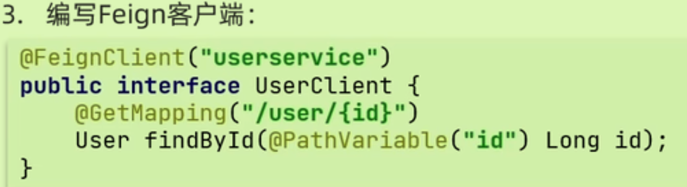

使用时，调用客户端和其中方法即可。

Feign内部也可以做到负载均衡，因为其底层有Ribbon的包。

### 自定义Feign配置（日志）

**最好采用Basic**

在配置文件中进行：

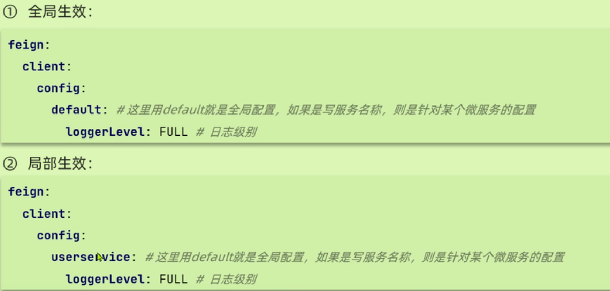

在Java代码中进行：

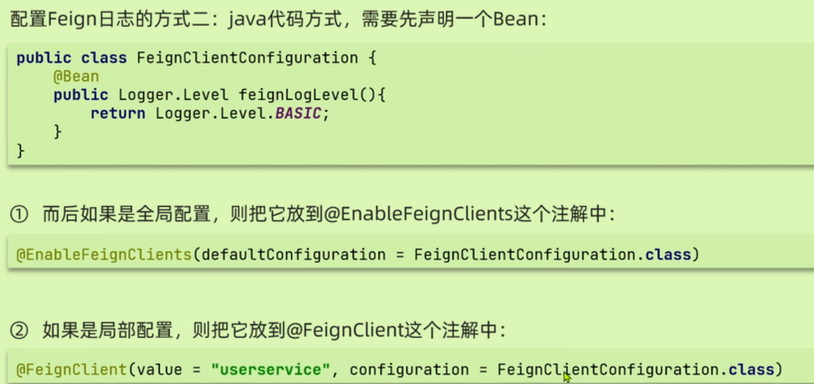

### Feign性能优化

使用`Apache HttpClient`代替默认的`URLConnection`，变为**支持连接池**，从而提高性能。

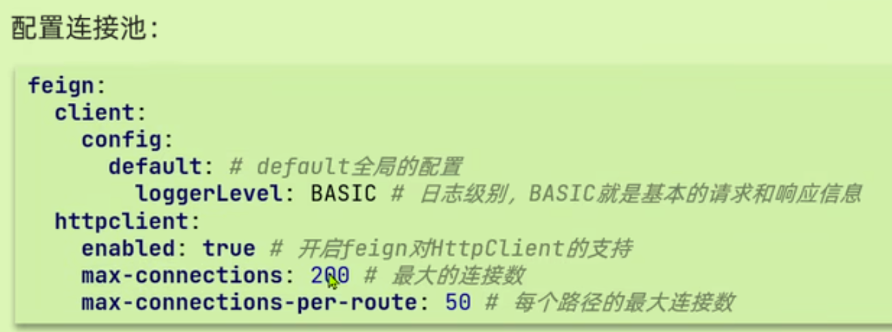

### 最佳实践

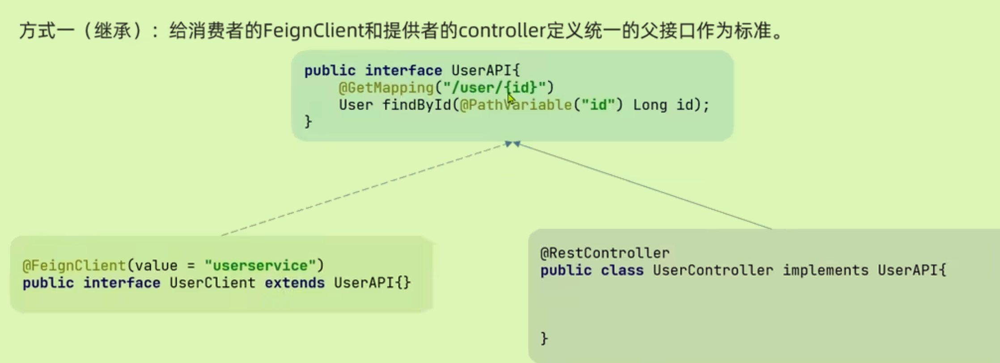

但是不推荐在服务端和客户端使用同一接口。

防止FeignClient会在不同的微服务中写多遍：

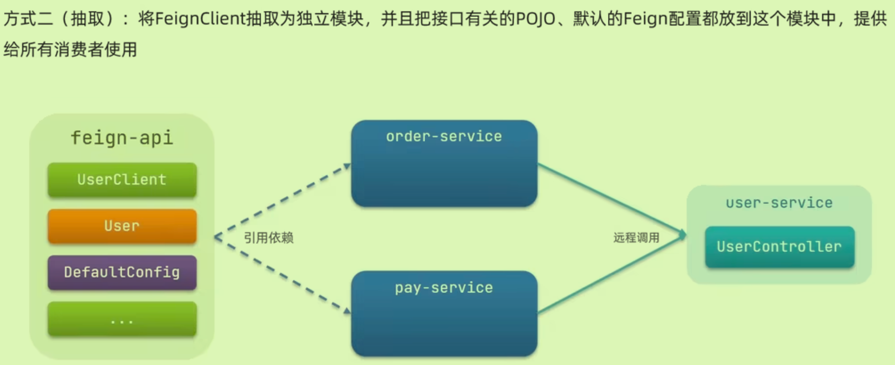