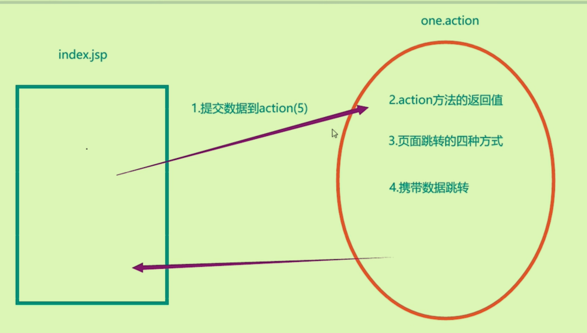

## SpringMvc大致流程

核心处理器`DispacterServlet`调用三个强大的方法来解决问题

## WEB请求流程

所有的web请求都要经过servlet；`DispacterServlet`需要在web.xml注册才可以作为一个servlet使用。




### RequestMapping

- 注册出一个路径，可以让客户端通过超链接访问到服务器的对应页面。
- 可以区分出get请求和post请求:通过method属性

## 五种数据提交方式优化

### 单个数据提交

```java
    @RequestMapping("/one")
    public String one(String myname, int age){
        System.out.println("myname=" + myname + ",age=" + (age + 100));
        return "main";
    }
```


### 对象封装提交

保证请求参数与实体类的成员变量名称一致——就可以实现自动提交，自动类型转换，自动封装数据到对象中。

```java
    @RequestMapping("/two")
    public String two(User user){
        System.out.println(user);
        return "main";
    }
```


### 动态占位符提交

仅限于超链接或地址栏提交数据：表单处一杠一值，对应的RequestMapping的参数一杠一大括号，并且方法参数也要加`@PathVariable`注解

```java
    @RequestMapping("/three/{name}/{age}")
    public String three(@PathVariable String name, @PathVariable int age){
        System.out.println("name" + name + ",age=" + (age + 100));
        return "main";
    }
```

### 前后端映射名称不一致

使用`RequestParam`注解来解析。

```java
    @RequestMapping("/four")
    public String four(@RequestParam("name") String uname,
                       @RequestParam("age") int uage){
        System.out.println("uname=" + uname+",uage" + uage);
        return "main";
    }
```

### 手工提取数据

还是以前的request对象手动提取。


