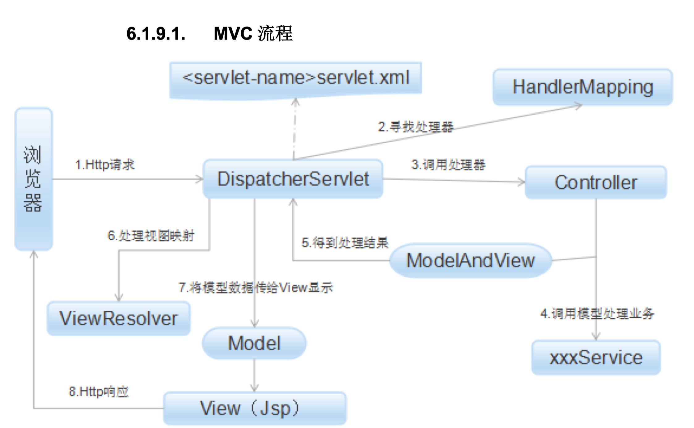
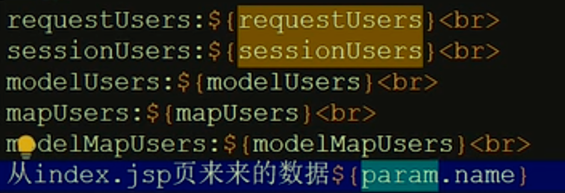
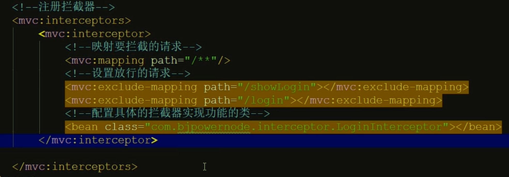

## SpringMvc大致流程

核心处理器`DispacterServlet`调用三个强大的方法来解决问题

- `HandlerMapping`从url中解析出*资源路径名称*（要访问的action名称）
- `HandlerAdapter`适配器，来创建出资源对象（完成了数据注入操作）；进行Service与Dao层的数据操作
- `ViewResolver`，处理视图映射



## WEB请求流程

所有的web请求都要经过servlet；`DispacterServlet`需要在web.xml注册才可以作为一个servlet使用。


### RequestMapping

- 注册出一个路径，可以让客户端通过超链接访问到服务器的对应页面。
- 可以区分出get请求和post请求:通过method属性

## 五种数据提交方式优化

### 单个数据提交

```java
    @RequestMapping("/one")
    public String one(String myname, int age){
        System.out.println("myname=" + myname + ",age=" + (age + 100));
        return "main";
    }
```


### 对象封装提交

保证请求参数与实体类的成员变量名称一致——就可以实现自动提交，自动类型转换，自动封装数据到对象中。

```java
    @RequestMapping("/two")
    public String two(User user){
        System.out.println(user);
        return "main";
    }
```


### 动态占位符提交

仅限于超链接或地址栏提交数据：表单处一杠一值，对应的RequestMapping的参数一杠一大括号，并且方法参数也要加`@PathVariable`注解

```java
    @RequestMapping("/three/{name}/{age}")
    public String three(@PathVariable String name, @PathVariable int age){
        System.out.println("name" + name + ",age=" + (age + 100));
        return "main";
    }
```

### 前后端映射名称不一致

使用`RequestParam`注解来解析。

```java
    @RequestMapping("/four")
    public String four(@RequestParam("name") String uname,
                       @RequestParam("age") int uage){
        System.out.println("uname=" + uname+",uage" + uage);
        return "main";
    }
```

### 手工提取数据

还是以前的request对象手动提取。


## 中文乱码解决

在web.xml文件中进行配置

```xml
<!--    中文编码过滤器设置-->
    <filter>
        <filter-name>encode</filter-name>
        <filter-class>org.springframework.web.filter.CharacterEncodingFilter</filter-class>
        <init-param>
            <param-name>encoding</param-name>
            <param-value>UTF-8</param-value>
        </init-param>
        <init-param>
            <param-name>forceRequestEncoding</param-name>
            <param-value>true</param-value>
        </init-param>
        <init-param>
            <param-name>forceResponseEncoding</param-name>
            <param-value>true</param-value>
        </init-param>
    </filter>
    <filter-mapping>
        <filter-name>encode</filter-name>
        <url-pattern>/*</url-pattern>
    </filter-mapping>
```


## Action方法返回值


多半应用于ajax请求。

### AJax项目

在控制层Action方法中使用`@ResponseBody`来解析ajax请求，并且需要在springmvc.xml文件中添加注解驱动为了支持ajax请求。

### Action默认参数类型

不需要创建，直接拿来使用。


**重定向只能用Session**，其他都放在请求作用域（重定向会丢失）

```java
@RequestMapping("/data")
public String data(HttpServletRequest request,
                   HttpServletResponse response,
                   HttpSession session,
                   Model model,
                   Map map,
                   ModelMap modelMap){
  //创建数据对象
  Users u = new Users("张三",22);
  //传递数据到参数对象上
  request.setAttribute("requestUsers",u);
  model.addAttribute("modelUsers",u);
  map.put("mapUsers",u);
  modelMap.addAttribute("modelMapUsers",u);
  return "main";
}
```

在jsp文件中显示数据,使用${xxx}



## 四种跳转方式

### 重定向

地址栏是最终要跳转到的客户端地址

```java
@RequestMapping("/three")
public String three(){
  System.out.println("这是重定向页面");
  return "redirect:/admin/main.jsp";//屏蔽前后缀，实现重定向跳转，必须自己写全路径
}
```

### 请求转发

地址栏是服务器地址（因为其原理基于服务器）前面的action都是请求转发方式。

使用`forward:`来自定义跳转。

```java
@RequestMapping("/two")
public String two(){
  System.out.println("这时请求转发action跳转");
  return "forward:/other.action";//forward:的作用是屏蔽前缀后缀的拼接，进行指定位置的请求转发
}
```

## 日期处理

每次处理日期为了美化都要用`SimpleDateFormat`这个类

### 单个日期注入处理

使用`@DattaTimeFormat`注解（需要在配置文件中引入相关配置）

```java
@RequestMapping("/mydate")
public String mydate(@DateTimeFormat(pattern = "yyyy-MM-dd") Date mydate){
  System.out.println(mydate);
  System.out.println(sf.format(mydate));
  return "show";
}
```

### 类中的全局日期注入

使用`@InitBinder`注解进行特殊数据绑定

```java
@InitBinder
public void initBinder(WebDataBinder dataBinder){
  dataBinder.registerCustomEditor(Data.class,new CustomDateEditor(sf,true));//sf就是SimpleDateFormat
    //注册一个转换器（需要转换的类型，转换器对象）
}
```

### 实体类对象的属性日期注入

注入就在set方法中加入`@DateTimeFormat`；JSON格式显示需要在get方法中加入`@JsonTimeFormat`；JSP页面显示需要使用JSTL标签库。

### 注意标签


## 访问WEB-INF中的内容

不能直接访问，只能请求转发。

需要更改springmvc.xml文件中的视图解析器

### 对于请求后缀的处理

在`web.xml`文件中注册spirngmvc框架时，改变拦截器的配置（/是全局匹配）


### 使用拦截器

针对请求和响应进行额外的处理——**预处理，后处理，最终处理**（处理之前，处理之后返回之前，全部结束）

`preHandle() postHandle() afterCompletion`

最好使用实现接口方式完成。`HandlerInterceptor`,重写上面三个方法。

#### 权限验证（对WEBINF很重要）

```java
public class LoginInterceptor implements HandlerInterceptor{
  @Override
  public boolean preHandle(HttpServletRequest request, HttpServletResponse response, Object handler) throws Exception){
    //判断是否登陆过
    if(request.getSession().getAttribute("users") == null){
      request.setAttribute("msg","error");
      request.getRequestDispatcher("/WEB-INF/jsp/login.jsp").forward(request,response);//请求转发跳回登录页面
    }
    return true;//如果登陆过就放行请求
  }
}
```

还要在配置文件中注册拦截器。

