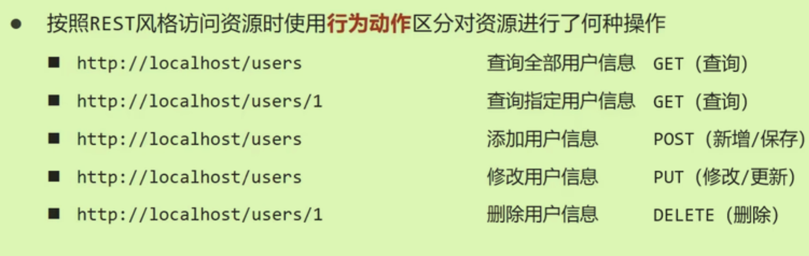
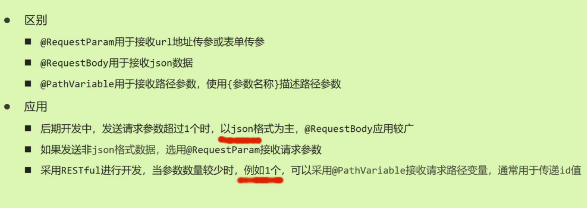

## REST开发风格

（地址）简便的描述访问网络资源，隐藏资源的访问行为

通过访问资源时的**不同行为动作**进行区分操作。



根据REST风格对资源进行访问称为*RESTful*

```java
@RequestMapping(value = "/users/{id}", method = RequestMethod.GET)//路径上有参数占位符
@ResponseBody//表示一个方法的返回值应该被直接写入Http响应体中，直接返回给客户端（比如序列化为JSON）
public String getById(@PathVariable Integer id){//形参前加Path注解
  System.out.println("user getById ..." + id);
  return "{'model' : 'user getById' }";
}
```

### 参数前的注解



### 简化

使用`@RestController`包含了两个重要注解：`@Controller,@ResponseBody`