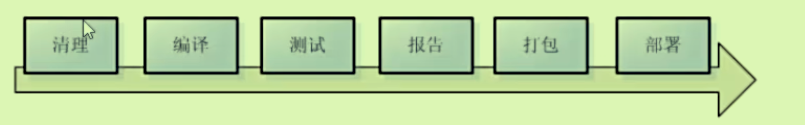
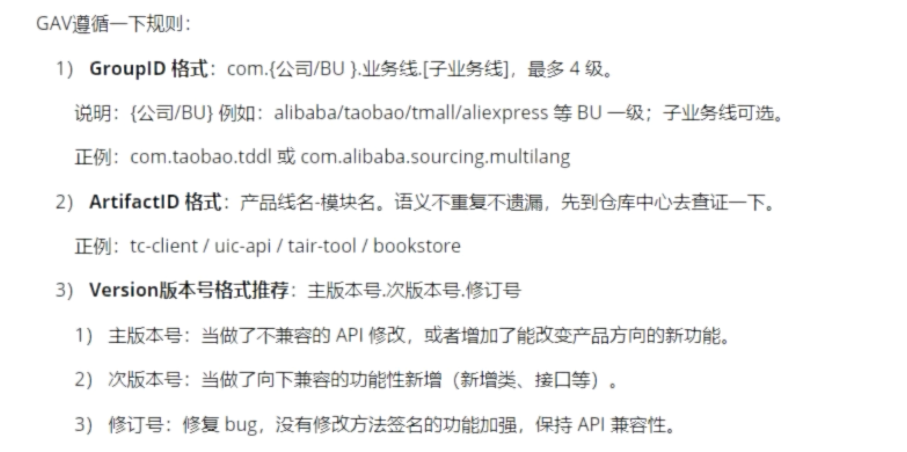
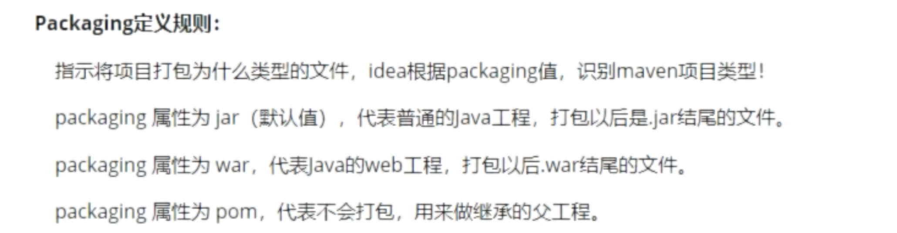
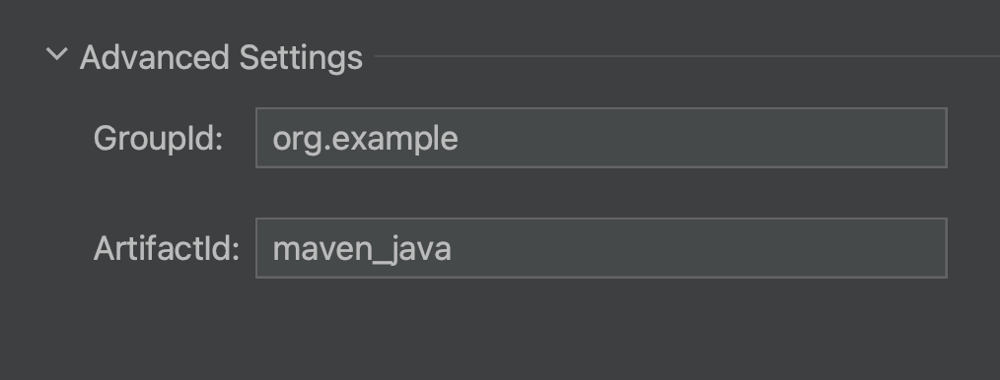
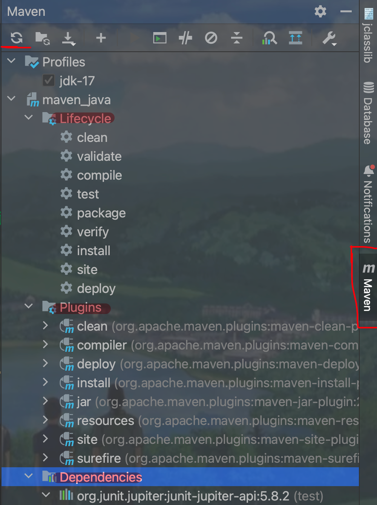
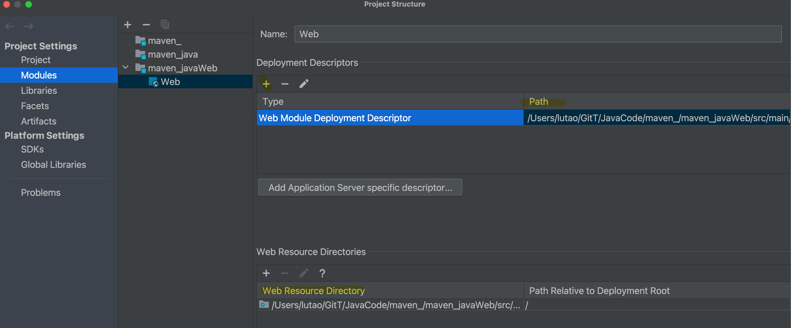
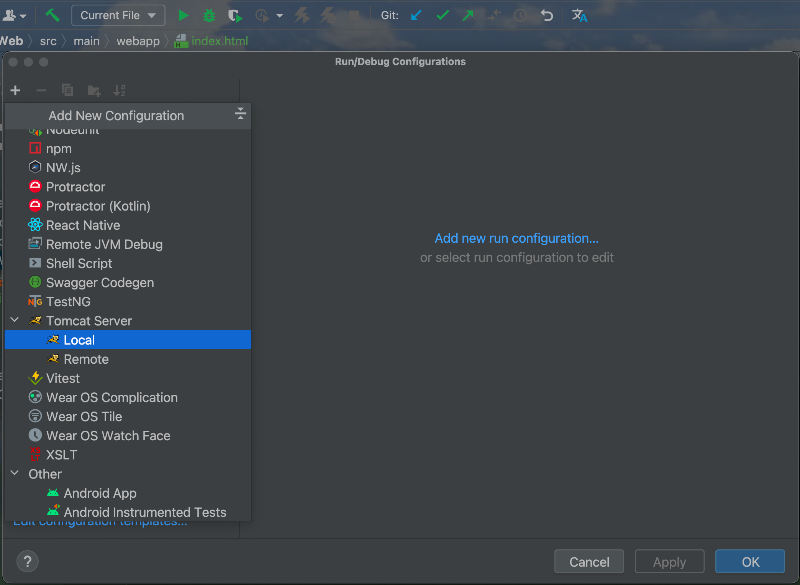
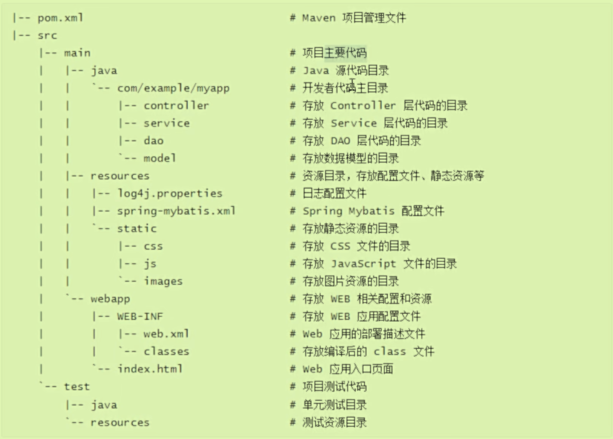

# 1

## Maven作用

### 管理Jar包

从镜像网站或者中央仓库下载库，且处理库之间的关系，避免版本冲突。使用**坐标（即路径）**完成

### 构建工具

将一系列的原材料生产出产品的过程，java—jar包；web—war包；大伙生产出来的jar包可以进行汇总使用。

IDEA会自动构建，但是服务器上是Linux需要Maven来构建项目。

maven开头的命令必须在pom.xml所在的目录中使用。

- `mvn compile`进行构建，每一次构建的结果都会在target目录中
- `mvn clean`将之前构建的结果清理掉_删除掉target
- `mvn test-compile`编译测试程序，`mvn test`执行当前测试类中的测试方法;注意，测试类起名必须以Test结尾9（开头），测试方法最好以test开头
- 报告并不需要相关指令
- 打包：`mvn package`，**保存在target目录**下打包时会将源代码进行编译，测试代码也会测试，但是**包中不会存在测试**
- 安装至本地仓库：`mvn install`为了让其他程序可以使用我们写好的jar包

## 原理

需要三种jar包，**自己工程中的jar包、网络上下载的jar包、maven插件需要使用的jar包**

## 重要概念GAVP

这些元素一起，确保了**每个 Maven 项目和库的唯一性**，并允许 Maven 正确地构建项目并管理依赖项。当你在 Maven 中添加一个依赖时，通常需要指定 GAV，即 Group ID，Artifact ID 和 Version，Packaging 通常是可选的，因为大多数依赖项都是 jar 文件。

new Module时会出现的。默认工程名=模块名Artifact

## 使用IDEA创建Maven的Java工程

具有main和test两个包，一个放源文件一个放测试文件。

### 从外部导入jar包

在Maven Repository网站中进行搜索jar包，复制内容到pom.xml中dependencies标签中，在Maven管理界面进行更新即可导入外部的jar包。

## 创建Maven的JavaWeb工程

### 手动创建

在模块对应的xml文件中添加war作为打包方式`<packaging>war</packaging>`

在项目结构中创建相同路径的webapp目录（在src/main下面）

### 自动创建

使用TestMangement插件进行创建

### 将web工程部署到Tomcat上

将本地Tomcat添加到配置中来

之后在Deployment中部署即可

## Maven的项目结构

结构已经提前配置好了

区分源代码和测试代码。