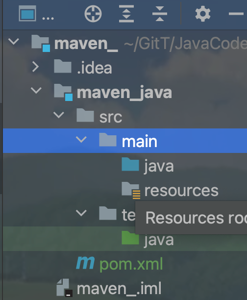

# Maven依赖、构建、坐标、创建、结构

## Maven作用

### 依赖管理Jar包

从镜像网站或者中央仓库下载库，且处理库之间的关系，避免版本冲突。使用**坐标（即路径）**完成（必须先安装到本地仓库）

- Maven还可以处理依赖关系：如果只导入核心功能jar包，无法实现，还需要导入此jar包相关的依赖；而Maven会自动导入相关依赖。（还有版本冲突问题）

#### 具体配置依赖

- dependencies来包住所有的依赖，使用dependent包住单个依赖
- 有的依赖没有scope有的有scope，表示依赖范围
- properties配置Maven工程的属性，可以*自定义属性*如`<junit.version>5.9.2</junit.version>`，在其他地方使用`${junit.version}`来调用属性——**GAV中只能改变V**

#### 依赖范围

三个范围：Main（编译范围）、Test（测试范围）、最终打包后（运行范围）

**默认是compile,在三种范围均可用**、test只对Test可用（如Junit）、provided运行范围内不能用（servlet-api此依赖由服务器提供，无需运行时重复提供）

#### 依赖下载失败

如果遇到下载丢包，需要操作的是删除之前下载的缓存文件（**lastUpdated文件**)，根据坐标找到文件目录中的jar包，都在**maven-repository中寻找**

#### 依赖特性

1. 传递特性

- 自动导入上下层依赖，简化依赖导入过程（可以自动导入某个依赖的父依赖），确保依赖的版本正确

- 传递有限制，A->B->C,C中的依赖能否传到A中取决于B->C的**依赖范围（见上方笔记）**

  - **只有compile范围可以传递**；如果想要传递也可以改变scope（*不建议改变*）
  - 如果B设置了`<optional>true</optional>`标签，也不可以传递（这是从**被依赖方出发**）
  - 依赖冲突（项目中存在相同的jar包的不同版本）

2. 处理依赖冲突
- 自动解决
	- *短路优先*原则（第一原则）：挑一个依赖层级较小的版本
	- 依赖路径相同时，*先到先得*（第二原则）：看dependencies中谁先来的（虽然都变灰色了）
- 手动解决exclusions标签
	- 这是**从依赖方出发**的操作。
	- 当A->B时，可以在A的xml文件中依赖B的配置中将某些特定的依赖排除
	- 
	


### 构建工具

将一系列的原材料生产出产品的过程，java—jar包；web—war包；大伙生产出来的jar包可以进行汇总使用。

IDEA会自动构建，但是服务器上是Linux需要Maven来构建项目。


maven开头的命令必须在pom.xml所在的目录中使用。

- `mvn compile`进行构建，每一次构建的结果都会在target目录中
- `mvn clean`将之前构建的结果清理掉_删除掉target
- `mvn test-compile`编译测试程序，`mvn test`执行当前测试类中的测试方法;注意，测试类起名必须以Test结尾9（开头），测试方法最好以test开头
- 报告并不需要相关指令
- 打包：`mvn package`，**保存在target目录**下打包时会将源代码进行编译，测试代码也会编译并测试，但是**包中不会存在测试**（测试也是一个过程）
- 安装至本地仓库：`mvn install`为了让其他程序可以使用我们写好的jar包

以上命令均可以在IDEA中进行可视化构建（右侧）


#### 构建的生命周期

对应多个固定命令的有序集合；使用周期命令构建简化了构建的过程：

- Maven的生命周期提供了一个标准化的构建过程。这意味着不论项目的大小或复杂性，所有Maven项目都遵循相同的构建步骤（例如清理、编译、测试、打包、部署等）
- Maven的生命周期可以通过插件进行扩展。如果标准生命周期不能满足特定需求，可以很容易地添加自定义阶段或修改现有阶段的行为。这种灵活性允许Maven适应多种不同的项目需求。

最终**执行构建的是插件**！！！

#### Build标签用来自定义构建

- 可以自定义输出包名
- 可以指定输出所包含的文件类型

```xml
        <resources>
            <resource>
                <!--资源所在目录 -->
                <directory>src/main/java</directory>
                <includes>
                    <!--设置包含的资源类型 -->
                    <include>**/*.xml</include>
                </includes>
            </resource>
        </resources>
```

- 可以配置插件

## 原理

需要三种jar包，**自己工程中的jar包、网络上下载的jar包、maven构建需要使用的jar包**（构建的过程需要有插件的支持） 

## 重要概念GAVP

这些元素一起，确保了**每个 Maven 项目和库的唯一性**，并允许 Maven 正确地构建项目并管理依赖项。当你在 Maven 中添加一个依赖时，通常需要指定 GAV，即 Group ID，Artifact ID 和 Version，Packaging 通常是可选的，因为大多数依赖项都是 jar 文件。


new Module时会出现的。默认工程名=模块名Artifact

## 使用IDEA创建Maven的Java工程



**具有main和test两个包，一个放源文件一个放测试文件**。

### 从外部导入jar包

在Maven Repository网站中进行搜索jar包，复制内容到pom.xml中dependencies标签中，在Maven管理界面进行更新即可导入外部的jar包。


## 创建Maven的JavaWeb工程

### 手动创建

在模块对应的xml文件中添加war作为打包方式`<packaging>war</packaging>`

在项目结构中创建相同路径的webapp目录（在src/main下面）


### 自动创建

使用TestMangement插件进行创建

### 将web工程部署到Tomcat上

将本地Tomcat添加到配置中来


之后在Deployment中部署即可

## Maven的项目结构

结构已经提前配置好了


区分源代码和测试代码。