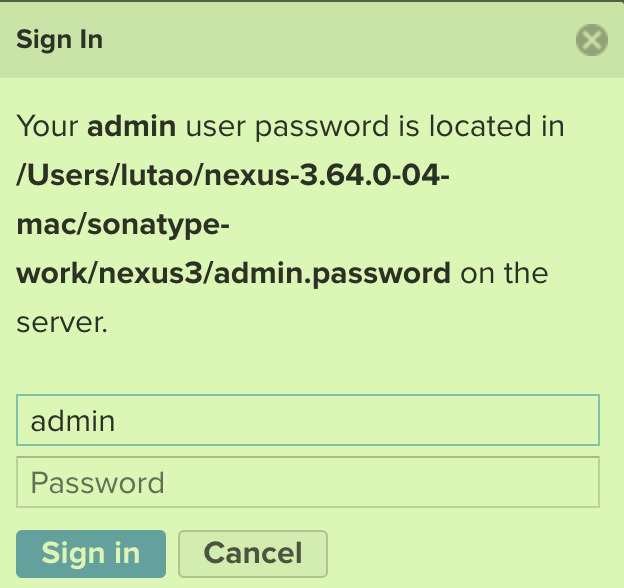
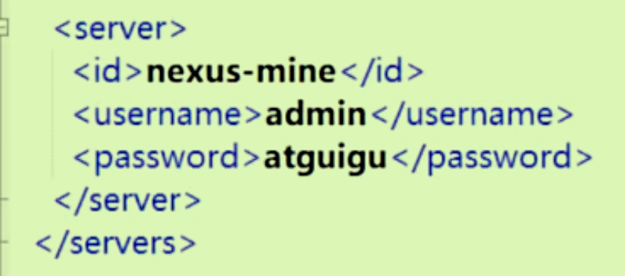

# Maven工程、私服、Nexus、综合案例

## Maven工程继承

一个项目从另一个项目中**继承配置信息**——大型项目分为多个Module，每个Module都有配置信息，这些信息放在父工程中让子工程来继承。(还可以继承依赖关系)

父工程中不需要任何的java代码，只保存配置信息，jar包的组合信息；不需要参与打包，故**打包方式为pom**

### 继承语法

子工程的GroupID和Version与父工程保持一致。所以在子工程中只能看见A artifact：

### 统一依赖管理

由于继承会直接将父工程的所有依赖给子工程（不论依赖范围），所以父工程中不再使用`dependencies`关键字而是使用`dependencyMangement`,这样子工程需要手动选择所需依赖。

父工程中的写法：

子工程中选择：只需要复制G和A，版本号由父工程决定。

## Maven工程聚合

父工程对子工程来一键管理，一键构建

#### 聚合语法

在父工程中：如果手动创建子工程，会自动生成聚合；

module下写的是当前**子工程的路径**

 

## Maven私服

特殊的远程仓库（架设在局域网）

请求本地仓库，没有的话到Maven私服去请求，再没有去中央仓库或者镜像仓库去请求。

#### 优点

节省带宽，加快下载速度；将自己的jar包分享给局域网内部其他成员。

## Nexus私服

启动时进入nexus的bin目录下执行命令`./nexus run`，本质上是一个web，所以可以在浏览器中进行访问`localhost:8081`;出现以下页面证明启动成功。

登录时用户名默认为admin，密码在如图所示的文件中

### Nexus的各种仓库

- 第一个是从中央仓库中下载jar包（本质是链接）
- 一个组仓库，用来放从第一个里面下载的jar包
- 三四是自己的jar包上传点，三是正式版本的；四是测试状态下的

### 通过Nexus下载jar包

去配置Maven中的settings，将镜像网站改为所用私服：以后maven中下载jar包就先从私服中下载了。（注意url地址都是从Nexus页面中复制得来的）

如果设置了匿名访问，需要再设置server标签，注意id需要与镜像中的id对应

将当前jar包部署到私服中：LifeCycle中的deploy进行部署

使用私服中别人的jar包，指定具体所需的url来下载jar包

## Maven综合案例分析

父工程在xml中所做的：

- 设置打包方式为pom
- 设置依赖管理managment
- 设置构建相关信息build
- 自动实现聚合

子工程：

- 并不意味着我们需要在每一个子工程中都去手动设置很多来自于父工程的依赖
- 我们可以在子工程之间进行子工程之间的相互依赖，这样会更加简洁。
- 内部如果有用不到的依赖可以使用`exclusion`或者在原工程中使用`optional`进行排除